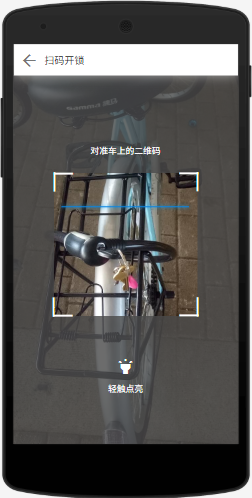
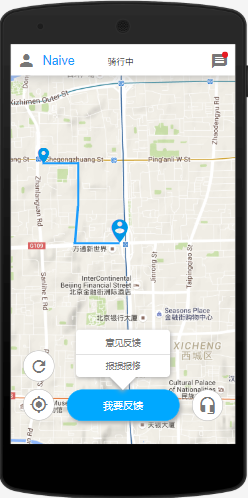
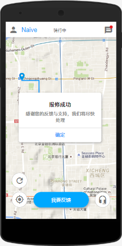
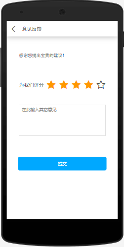
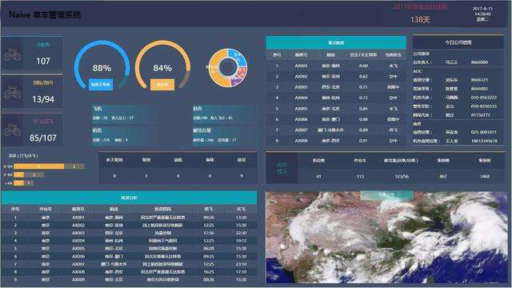

##### Part1：共享单车用户移动端APP界面

UI1：登录界面

需要用户首先输入账号（手机号码）和密码以使用该APP，若用户曾经登录过，那么默认自动登录。如果用户登录成功，那么转向界面UI2

​	UI1.1：用户如果没有账号，可以点击注册进入一个注册界面以注册账号

​	UI1.2：用户如果忘记账号密码，可以点击忘记密码进入找回密码界面通过绑定的手机找回账号密码

UI2：首页

用户登录后默认显示的界面

地图中的大标记显示的是用户所在的位置，小标记显示的是单车所在的位置。用户可以对地图进行放大和缩小寻找合适的单车。点击左下角的刷新图标之后对当前页面进行刷新和重加载，点击左下角的定位图标之后地图将以个人位置为中心。

​	UI2.1：点击扫码开锁之后，跳转至界面UI3

​	UI2.2：点击左上角个人图标之后显示个人信息界面

​	UI2.3：点击右上角消息图标之后显示用户收到的消息界面

​	UI2.4：点击右下角的客服图标之后显示客服咨询界面

UI3：扫码开锁界面

用户选择扫码开锁后显示的界面

点击轻触点亮之后打开手电筒

​	UI3.1：当识别框对准单车上的二维码并识别成功后，单车开锁，跳转至UI4界面

​	UI3.2：点击左上角的返回图标时，返回首页UI2界面

UI4：骑行界面（含报修）

识别单车成功并开锁之后显示的骑行界面

刷新按钮、定位按钮、客服按钮、个人图标与消息图标的作用与首页UI2中相同。地图中的小标记是单车开锁的位置（出发位置），大标记是当前单车的位置。蓝色的线条记录着当前单车行驶的轨迹。点击我要反馈后，会出现意见反馈和报损报修选项。

​	UI4.1：点击意见反馈后，跳转到意见反馈界面UI5

​	UI4.2：点击报损报修后，提示是否成功信息

UI5：意见反馈界面

点击小星星为我们打分（用户满意度），在输入框中输入意见

​	UI5.1：点击提交并成功之后，返回骑行界面UI4

​	UI5.2：点击左上角的返回图标之后，放弃意见反馈并返回骑行界面UI4

##### Part1：公司经理客户端界面

UI6：查看报表

查看报表界面提供展示：用车数据报表、用户反馈评价报表、用户报损报修数据报表、财务数据报表、各类任务信息报表、车辆分布数据报表，可点击查看各个报表展示详细信息，并提供数据可视化展示。

