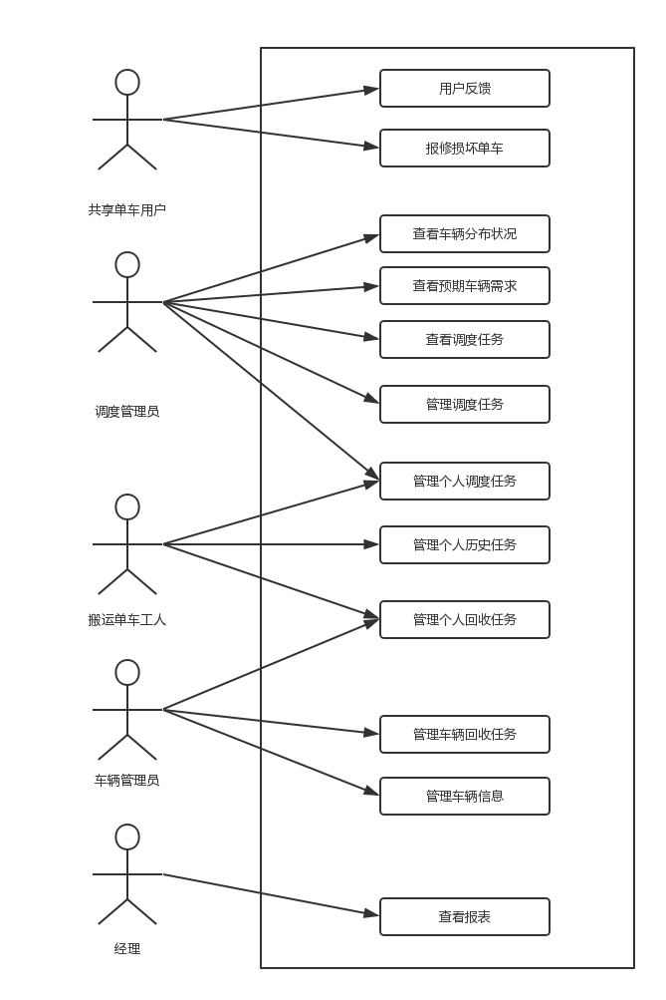
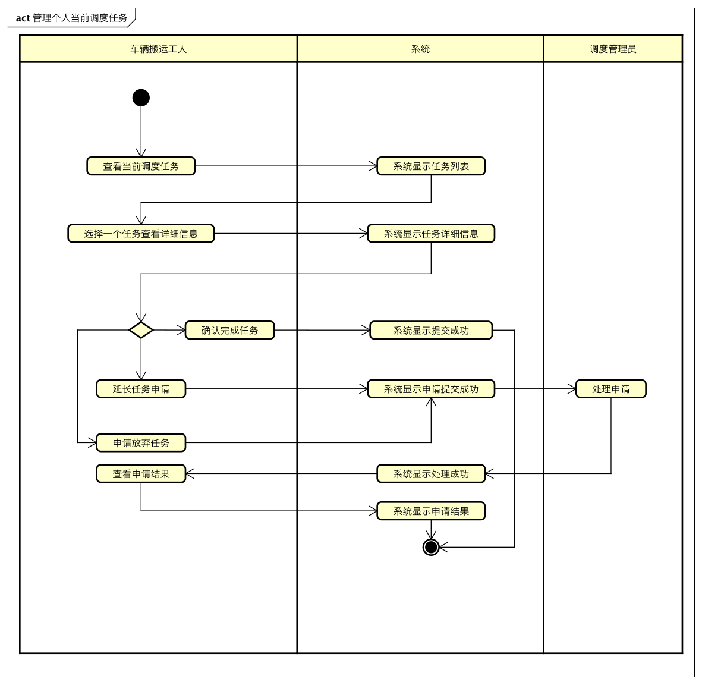
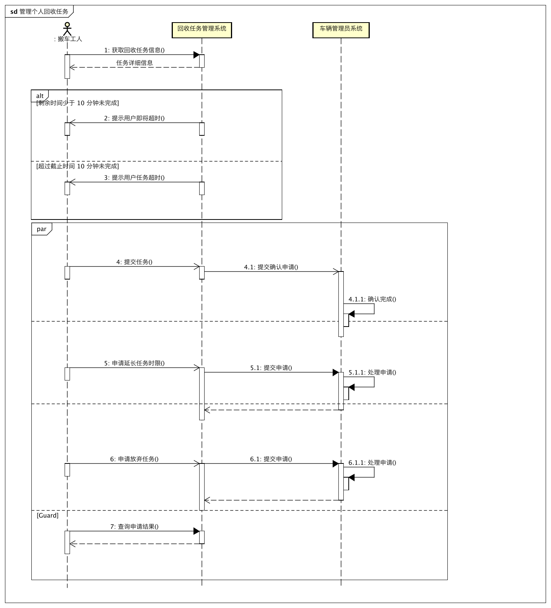
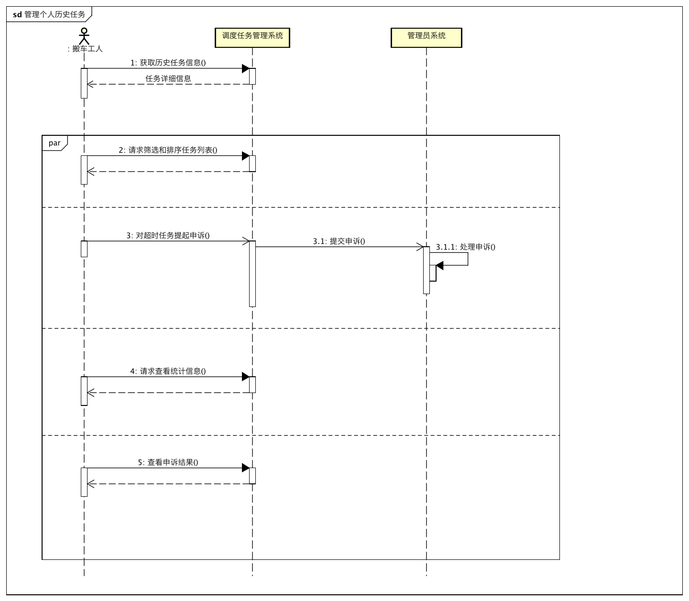
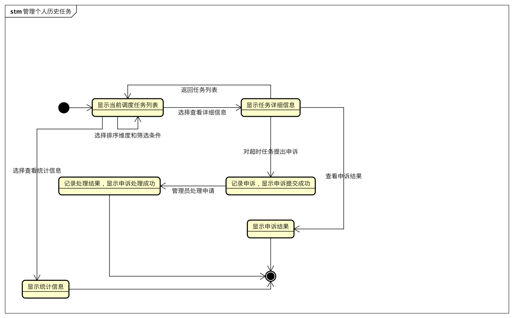
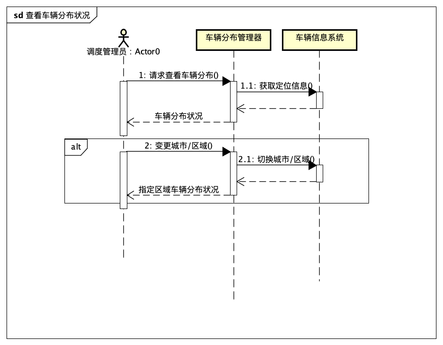
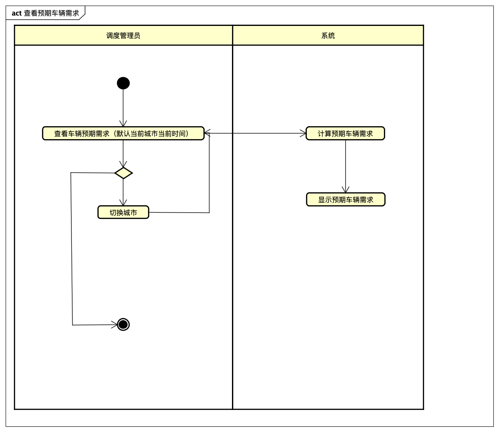
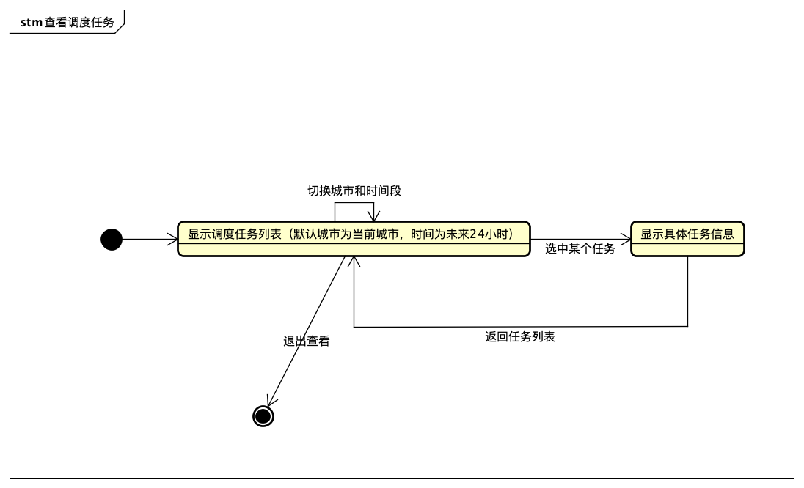
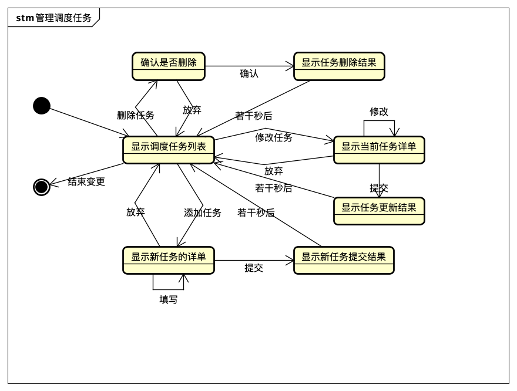
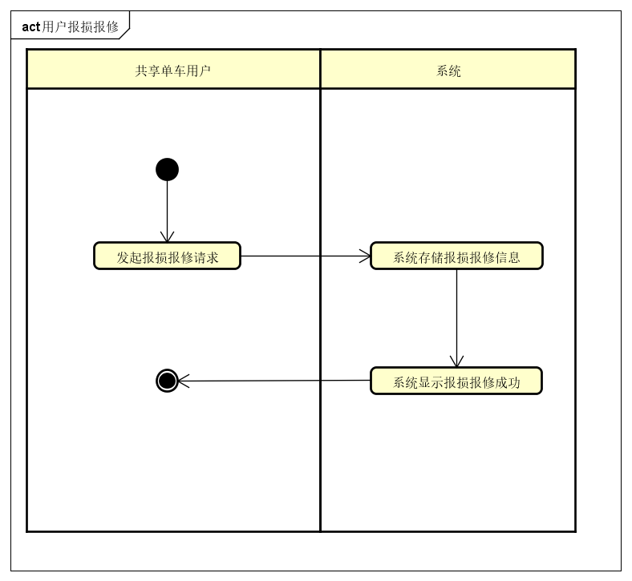

# 分析模型文档

| 日期         | 更新者  | 更新内容 | 版本号  |
| ---------- | ---- | ---- | ---- |
| 2018.11.13 | 陈俊宇  | 整合   | 1.0  |

[TOC]

## 概念类图和方法契约说明

### 概念类图

### 方法契约说明

1. 操作：

   增加调度任务

   addDispatchTasks(fromLocation, toLocation, content, time, limit, level)

   引用：

   ​	用例：管理调度任务

   不变量：

   ​	content为具体内容的描述

   ​	fromLocation和toLocation为出发地和目标地点的三维坐标

   ​	time为任务开始执行时间，格式为"yyyy-mm-dd hh:mm"

   ​	limit为数字类型，介于[0-?]之间，单位为秒

   ​	level为任务紧急状况

   前置条件：

   ​	调度管理人员已经登录

   后置条件：

   ​	创建一个调度任务Task

   ​	Task.fromLocation被设置为fromLocation

   ​	Task.toLocation被设置成toLocation

   ​	Task.content被设置为content

   ​	Task.time被设置为time

   ​	Task.limit被设置为limit

   ​	Task.level被设置为level

2. 操作：

   ​	延长任务申请处理

   ​	processLengthenTask(task, description, extraTime, approval)

   引用：

   ​	用例：管理员处理申请

   不变量：

   ​	task，调度/车辆任务

   ​	description，申请描述，

   ​	extraTime，延长的时间，以秒为单位，

   ​	approval，是否通过审批

   前置条件：

   ​	管理员已登录

   ​	当前任务还没有被完成

   后置条件：

   ​	如果同意，那么task.limit被设置为task.limit + extraTime

   ​	如果不同意，task类标识不变。		

3. 操作：

   ​	删除车辆回收任务

   ​	deleteRecallTask(task)

   引用：

   ​	用例：管理车辆回收任务

   不变量：

   ​	task，车辆回收任务

   前置条件：

   ​	管理员已登录

   ​	当前任务还没有被完成

   后置条件：

   ​	task被删除

4. 操作：

   ​	用户报损报修

   ​	repairBicycle(userId, content, cycleId, location)

   引用：

   ​	用户报损报修

   不变量：

   ​	userId，提出报损的用户的id

   ​	content，用户报损的描述信息

   ​	cycleId，用户所报损的车辆的编号

   ​	location为发出报损用户的定位信息，具体格式为其三维坐标x,y,z

   前置条件：

   ​	用户已登录

   后置条件：

   ​	创建一个报损报修项RepairItem

   ​	RepairItem.userId被设置为userId

   ​	RepairItem.cycleId被设置为cycleId

   ​	RepairItem.location被设置为location

   ​	RepairItem.content被设置为content

##用例图

## 详细用例说明

根据《Naive共享单车-用例文档》，对各用例进行面向对象分析建模后结果如下：

### 1. 管理个人当前调度任务

#### 1.1 活动图

#### 1.2 顺序图

#### 1.3 状态图

### 2. 管理个人当前回收任务

#### 2.1 活动图

#### 2.2 顺序图

#### 2.3 状态图

### 3. 管理历史任务

#### 3.1 活动图

#### 3.2 顺序图

#### 3.3 状态图

### 4. 用户反馈

#### 4.1 活动图

#### 4.2 顺序图

#### 4.3 状态图

### 5. 管理车辆信息

#### 5.1 活动图

#### 5.2 顺序图

#### 5.3 状态图

### 6. 管理车辆回收任务

#### 6.1 活动图

#### 6.2 顺序图

#### 6.3 状态图

### 7. 查看车辆分布状况

#### 7.1 活动图

#### 7.2 顺序图

#### 7.3 状态图

### 8. 查看车辆预期需求

#### 8.1 活动图

#### 8.2 顺序图

#### 8.3 状态图

### 9. 查看调度任务

#### 9.1 活动图

#### 9.2 顺序图

#### 9.3 状态图

### 10. 管理调度任务

#### 10.1 活动图

#### 10.2 顺序图

#### 10.3 状态图

### 11. 用户报损报修

#### 11.1 活动图

#### 11.2 顺序图

#### 11.3 状态图

### 12. 查看报表

#### 12.1 活动图

#### 12.2 顺序图

#### 12.3 状态图

