# 分析模型文档

| 日期       | 更新者 | 更新内容 | 版本号 |
| ---------- | ------ | -------- | ------ |
| 2018.11.13 | 陈俊宇 | 整合     | 1.0    |

[TOC]

## 概念类图

##用例图

## 详细用例说明

根据《Naive共享单车-用例文档》，对各用例进行面向对象分析建模后结果如下：

### 1. 管理个人当前调度任务

#### 1.1 活动图

#### 1.2 顺序图

#### 1.3 状态图

### 2. 管理个人当前回收任务

#### 2.1 活动图

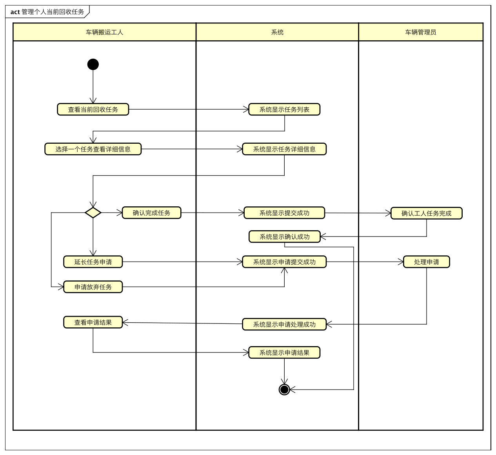

#### 2.2 顺序图

#### 2.3 状态图

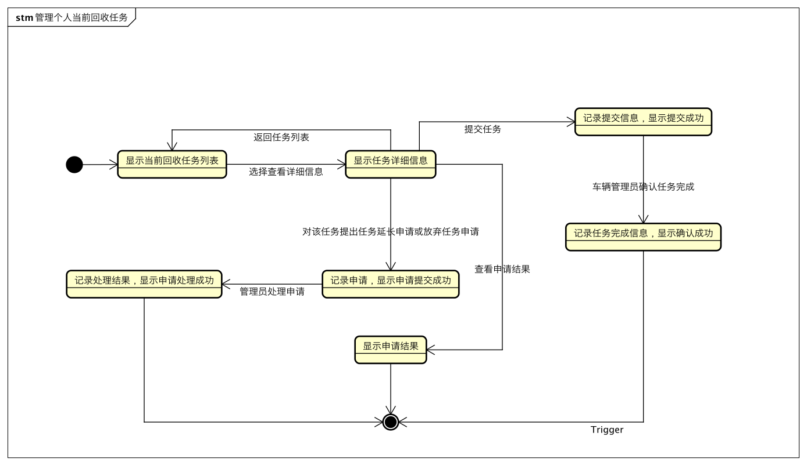

### 3. 管理历史任务

#### 3.1 活动图

#### 3.2 顺序图

#### 3.3 状态图

### 4. 用户反馈

#### 4.1 活动图

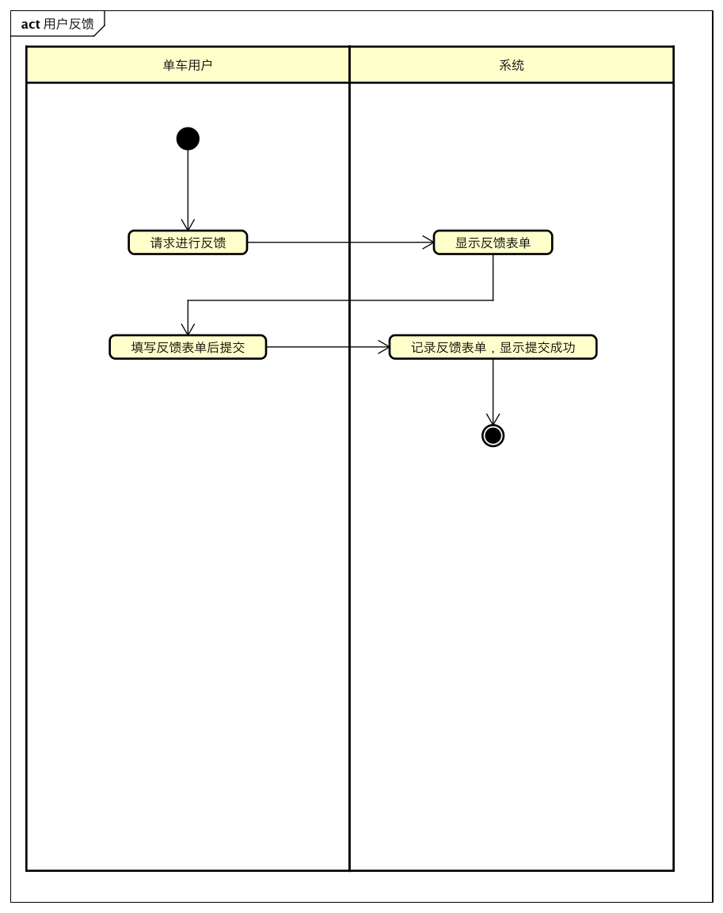

#### 4.2 顺序图

#### 4.3 状态图

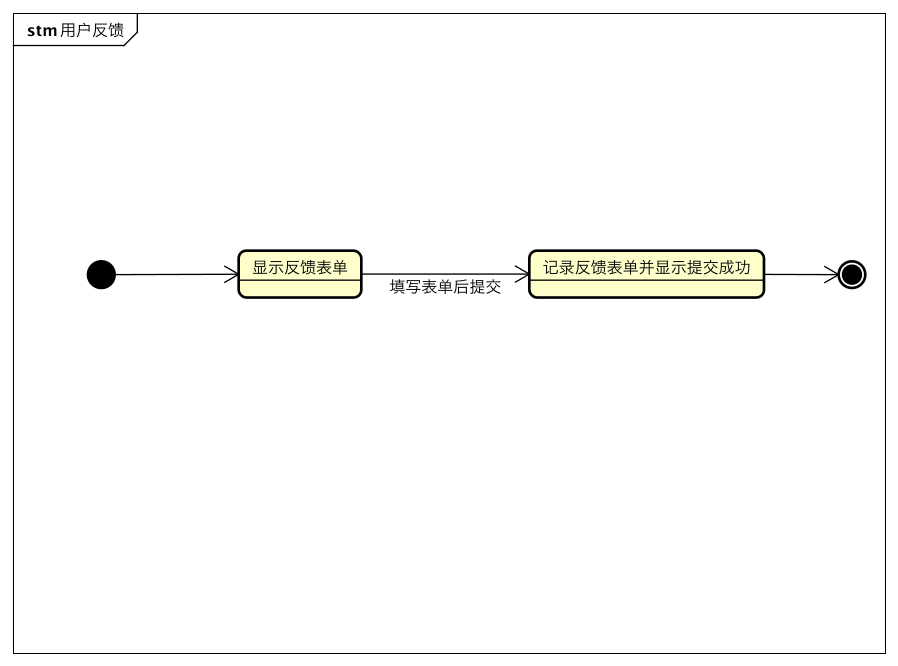

### 5. 管理车辆信息

#### 5.1 活动图

#### 5.2 顺序图

#### 5.3 状态图

### 6. 管理车辆回收任务

#### 6.1 活动图

#### 6.2 顺序图

#### 6.3 状态图

### 7. 查看车辆分布状况

#### 7.1 活动图

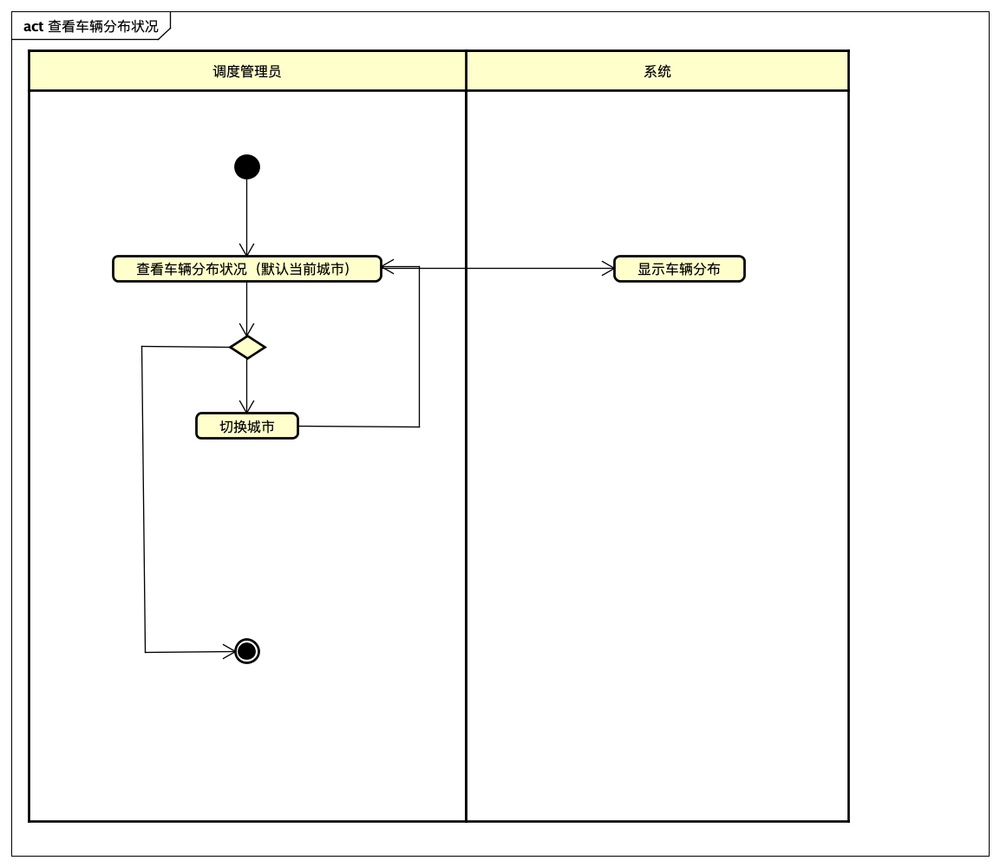

#### 7.2 顺序图

#### 7.3 状态图

### 8. 查看车辆预期需求

#### 8.1 活动图

#### 8.2 顺序图

#### 8.3 状态图

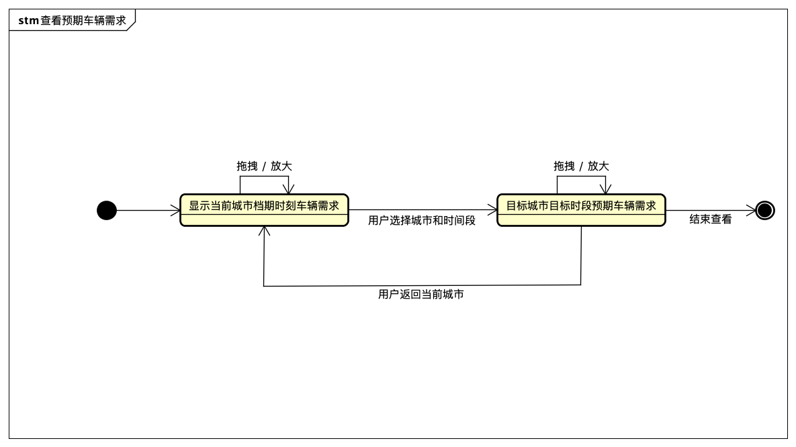

### 9. 查看调度任务

#### 9.1 活动图

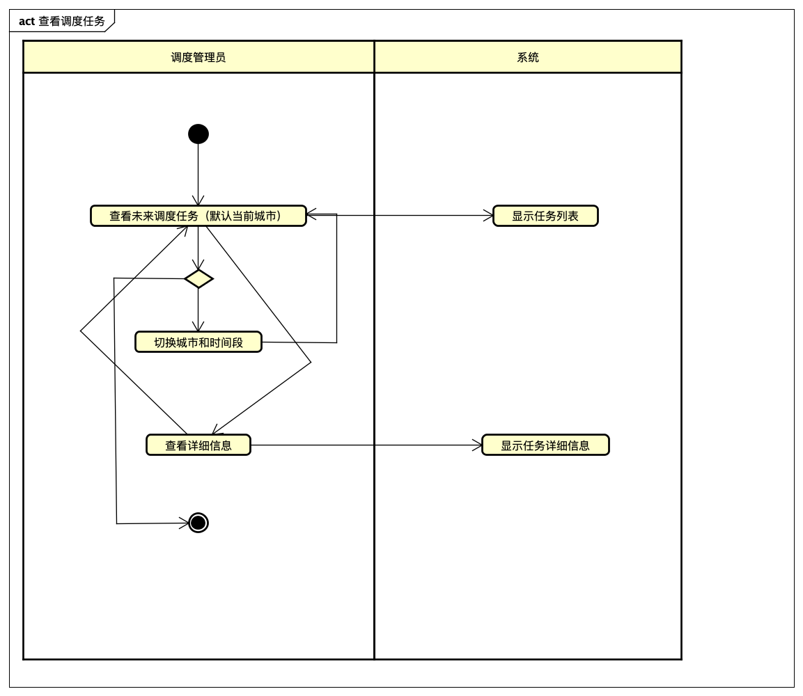

#### 9.2 顺序图

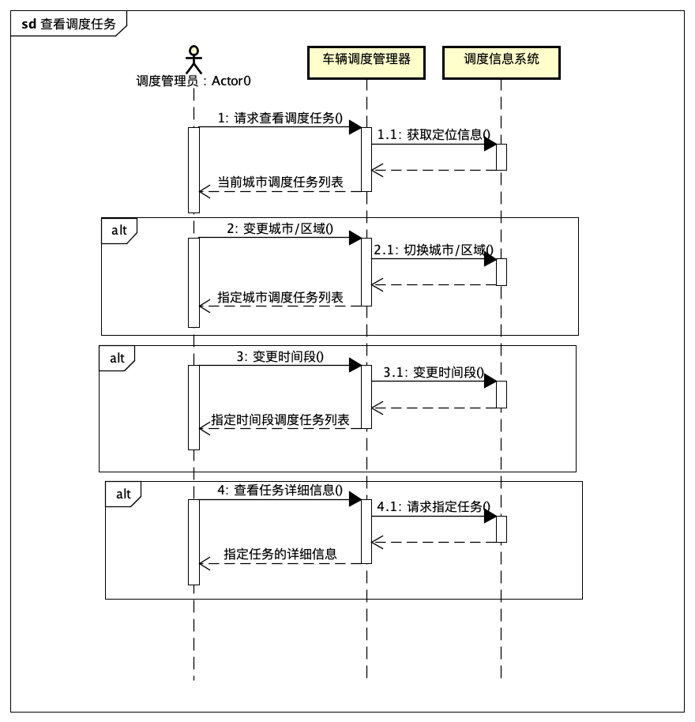

#### 9.3 状态图

### 10. 管理调度任务

#### 10.1 活动图

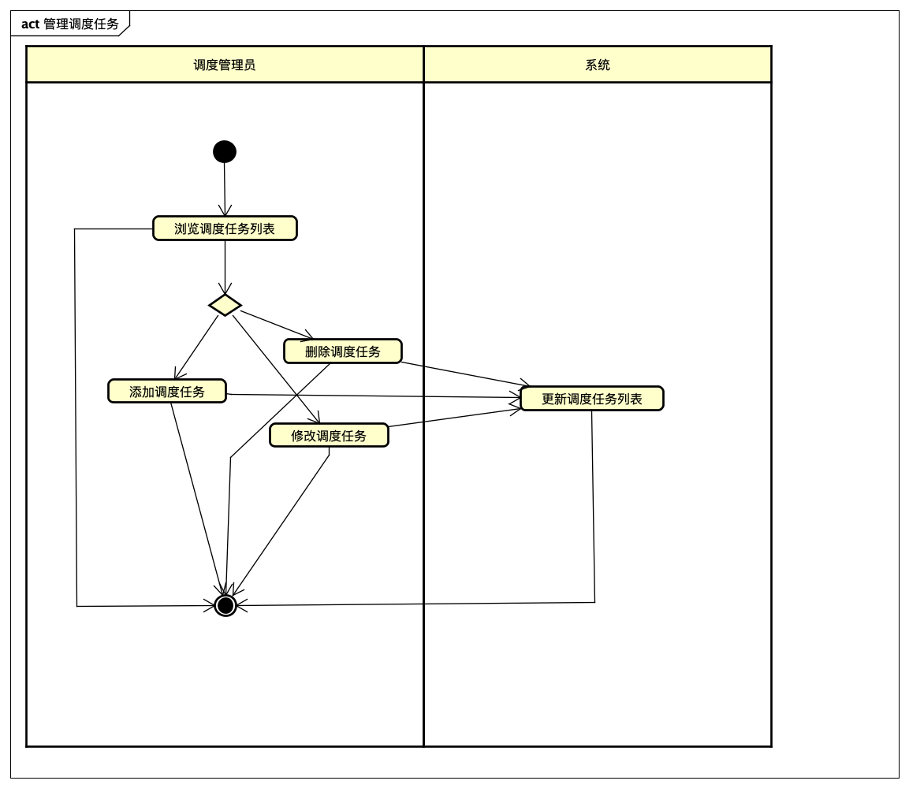

#### 10.2 顺序图

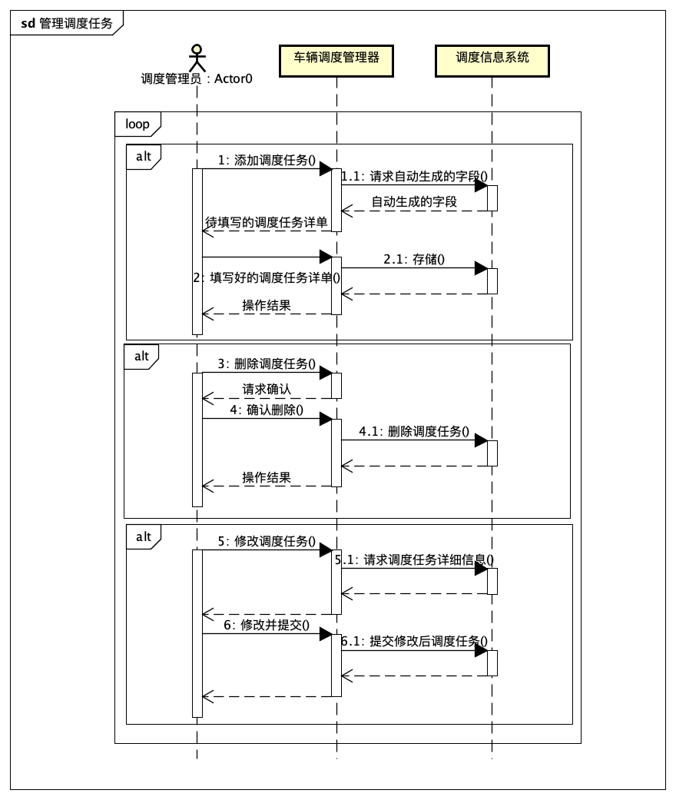

#### 10.3 状态图

### 11. 用户报损报修

#### 11.1 活动图

#### 11.2 顺序图

#### 11.3 状态图

### 12. 查看报表

#### 12.1 活动图

#### 12.2 顺序图

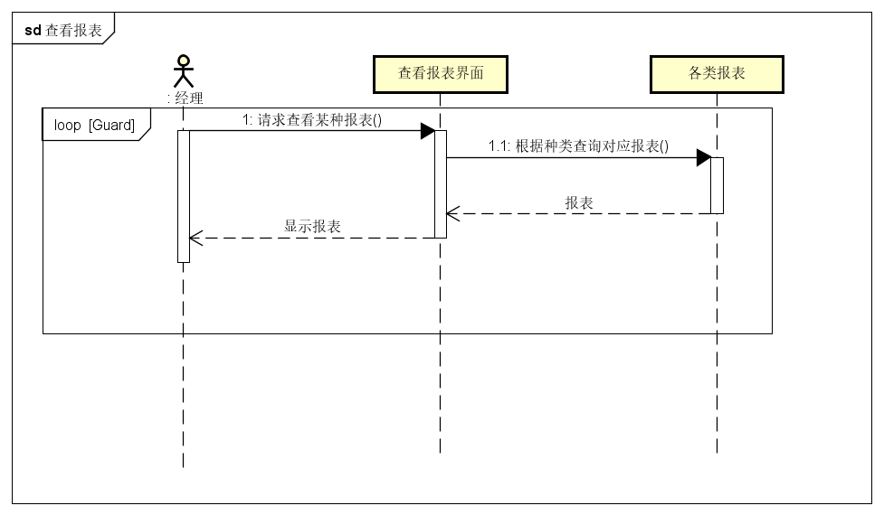

#### 12.3 状态图

