# 搬车工人_分析模型

### 管理个人当前调度任务

#### 活动图

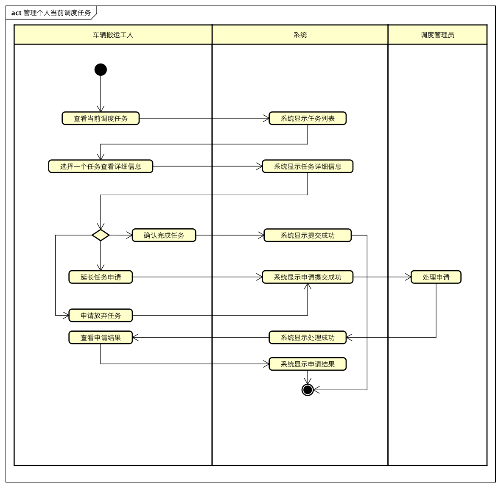

#### 顺序图

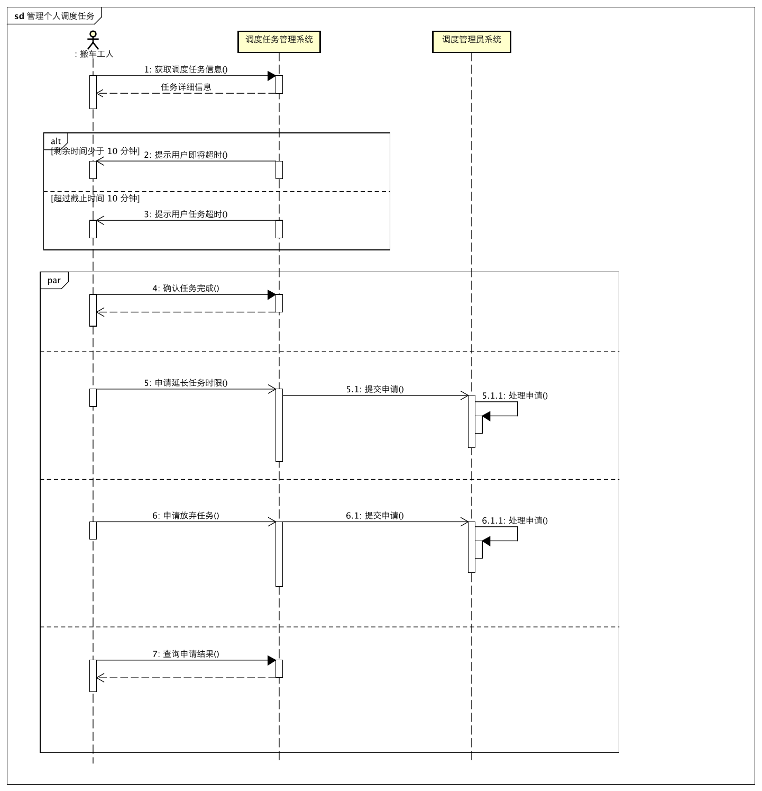

#### 状态图

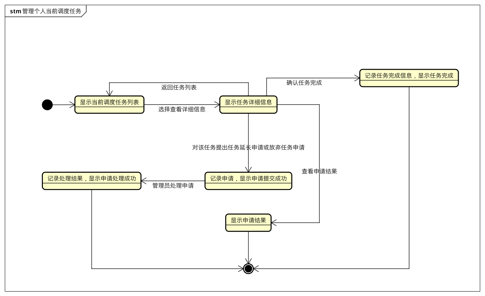

### 管理个人当前回收任务

#### 活动图

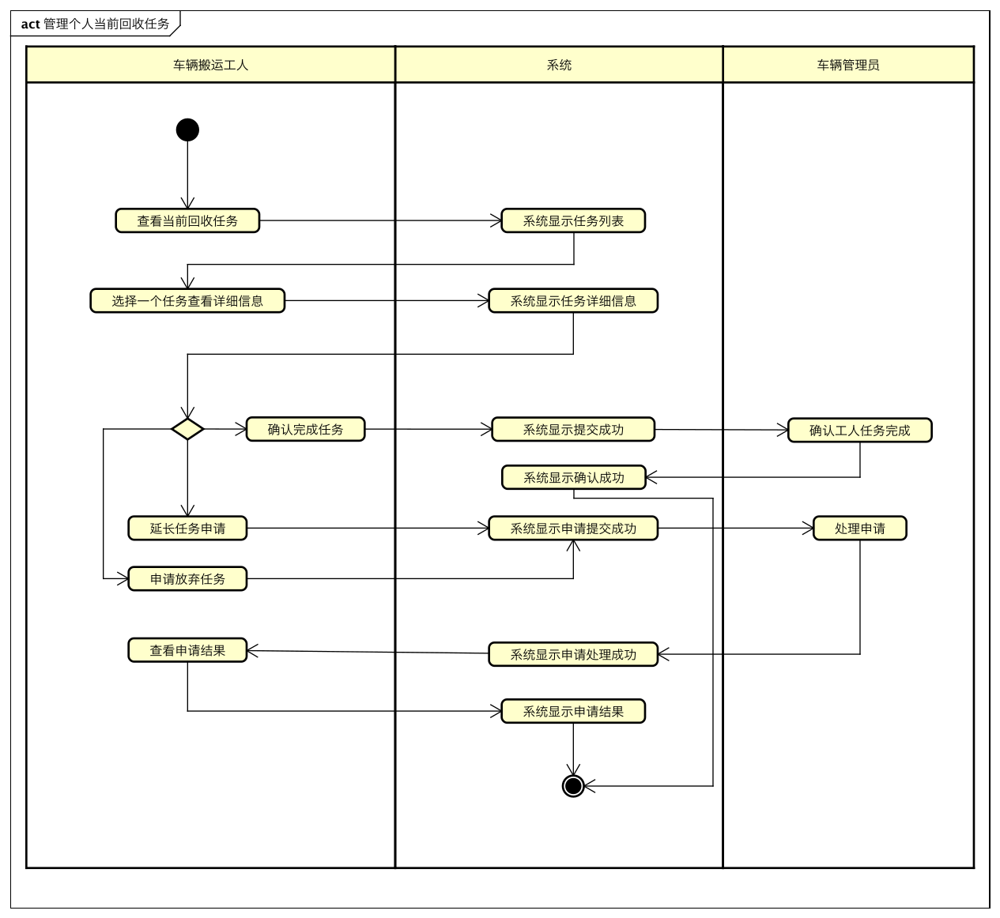

#### 顺序图

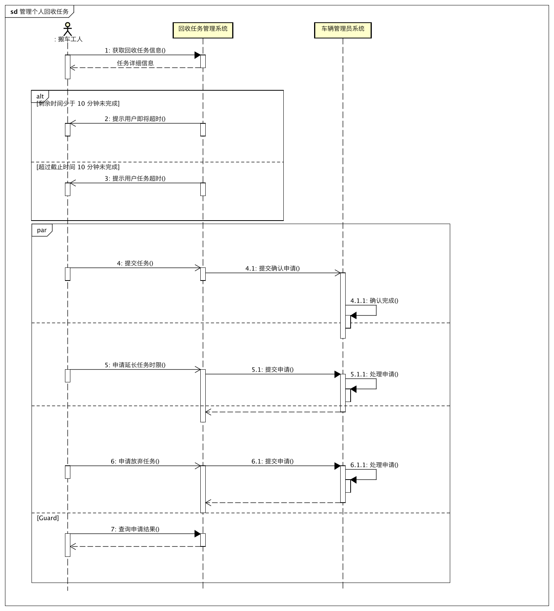

#### 状态图

### 管理历史任务

#### 活动图

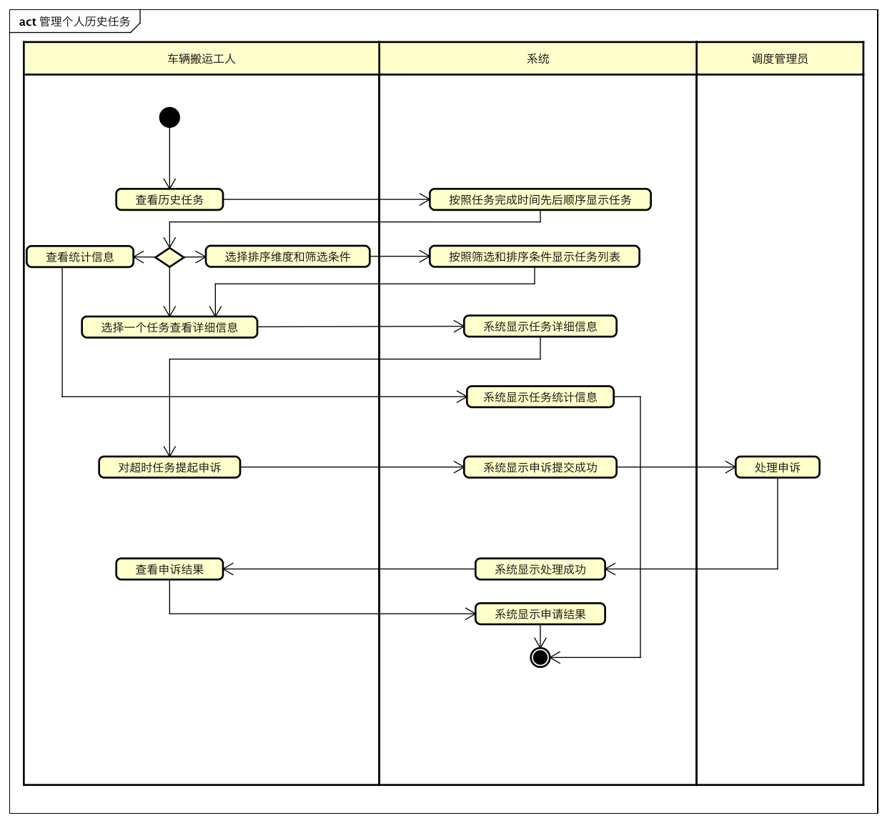

#### 顺序图

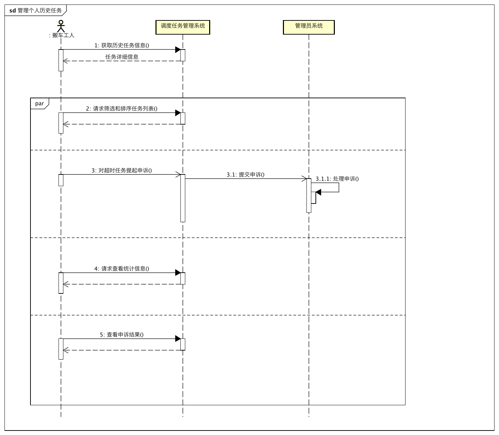

#### 状态图

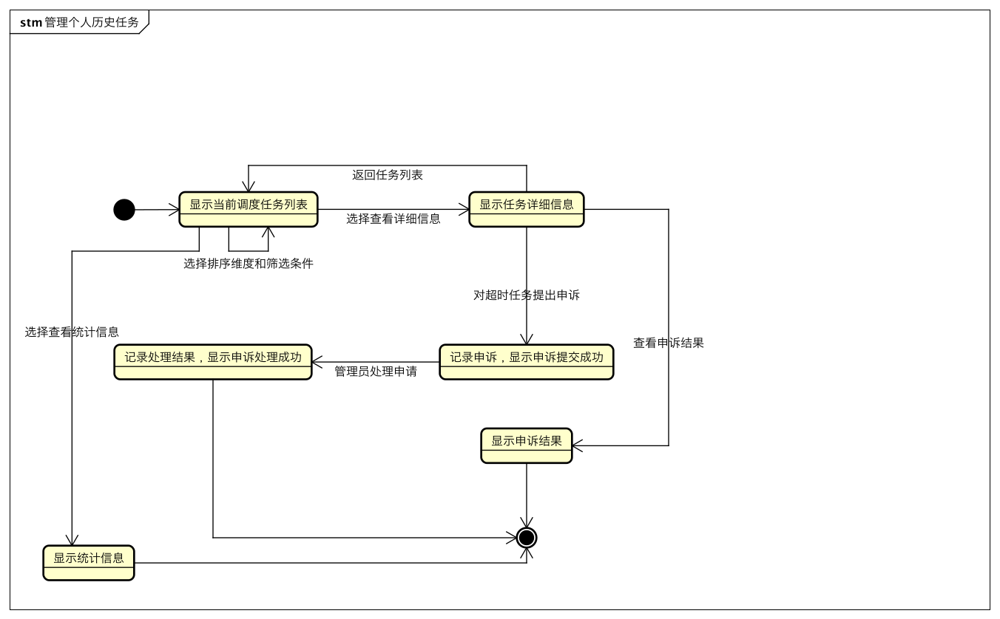

### 用户反馈

#### 活动图

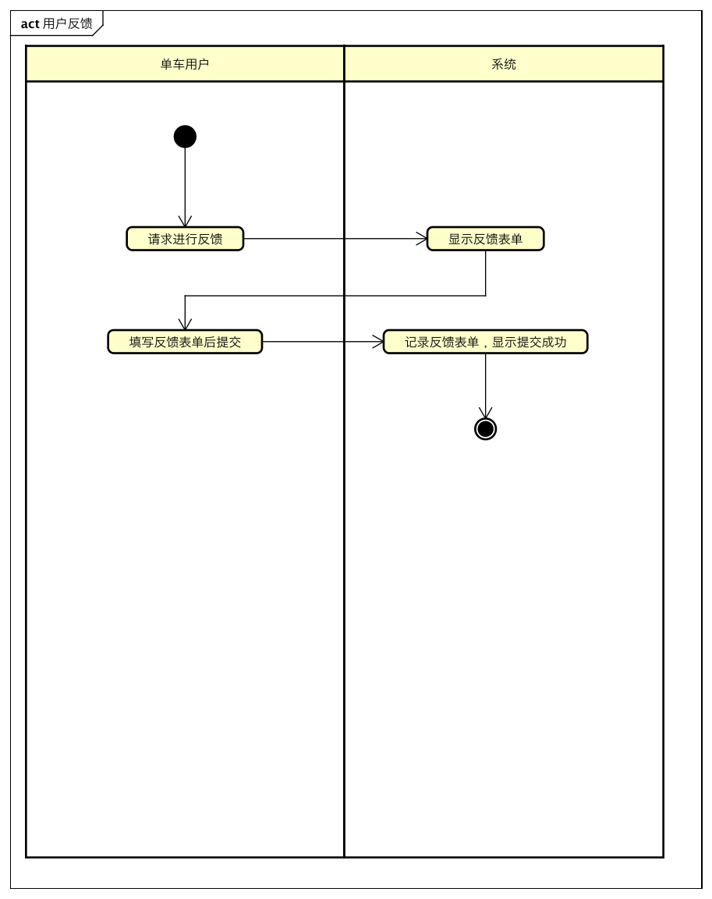

#### 顺序图

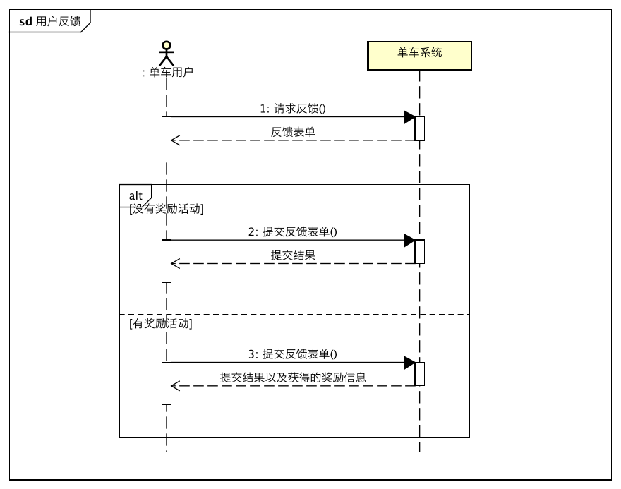

#### 状态图

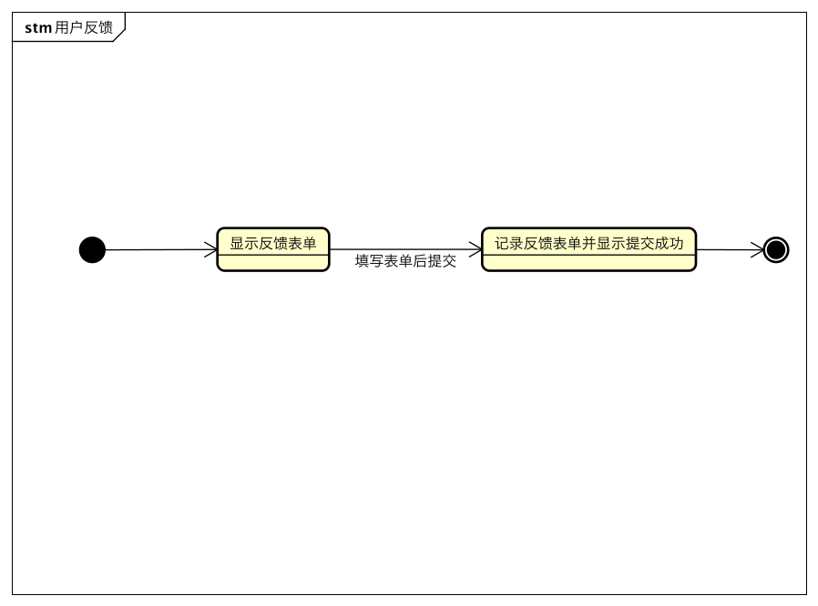