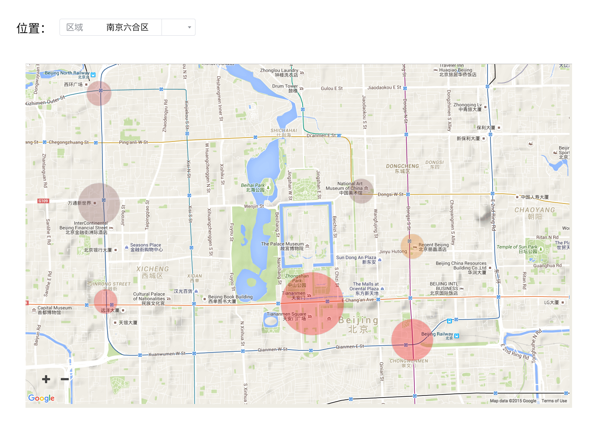
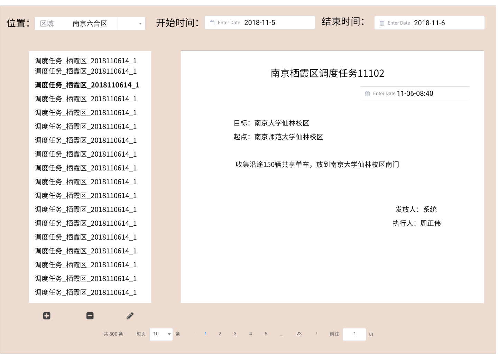
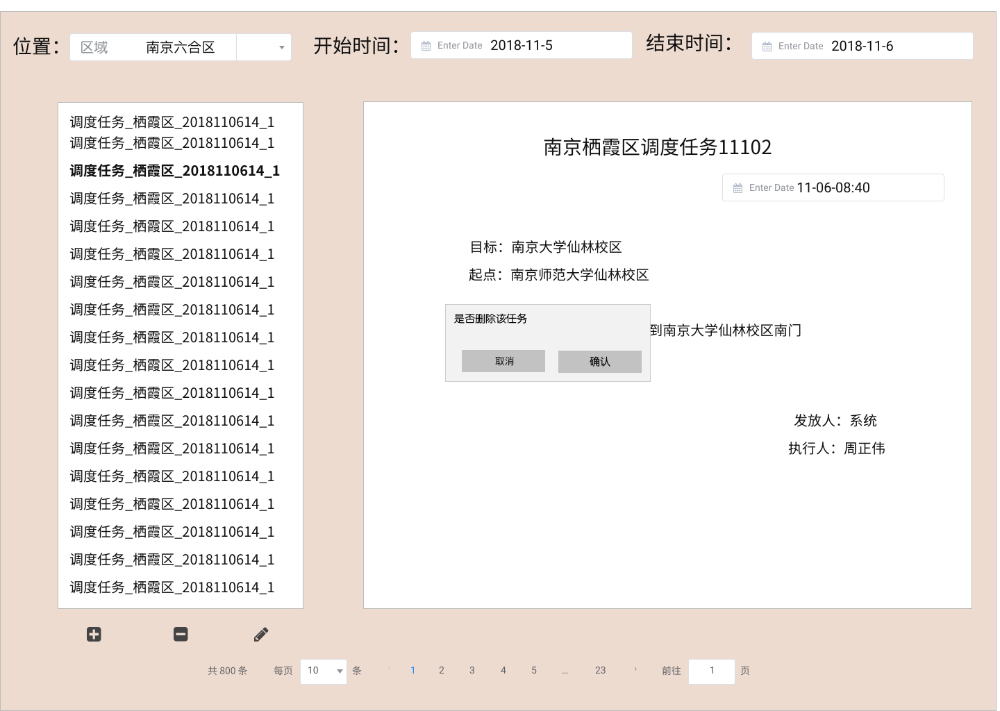

##### Part2：调度管理员客户端界面

- UI1：车辆分布状况

  查看车辆分布状况界面分成两个部分，位置选择部分和显示部分。

  点击`+` 或者 `-`可以对地图京放大或缩小。

  拖拽地图可以切换到周围显示区域。

​	UI1.1：鼠标移动到地图上可以看到某地区具体的车辆分布状况。

​	UI1.2：点击位置选择那的小按钮可以进入选择地区界面

- UI2：车辆预期需求

  整体情况和UI1类似。

  

  UI2.1：鼠标移动到地图上可以看到某地区具体的预期车辆需求。

  UI2.2：点击位置选择那的小按钮可以进入选择地区界面

- UI3：查看调度管理任务

  

  UI3.1：点击开始时间/结束时间可以选择时间

  UI3.2：点击位置选择那的小按钮可以进入选择地区界面

  UI3.3：点击下面的页码号可以切换页面

  UI3.4：点击左侧列表中的项可以切换右部表单

- UI4：管理调度任务

  

  整体情况和UI3的下属子页面相似。

  UI4.1：点击`+`号可以进入添加任务界面

  UI4.2：点击`-`号会提示删除任务

  UI4.3：点击`笔`或进入修改任务界面。