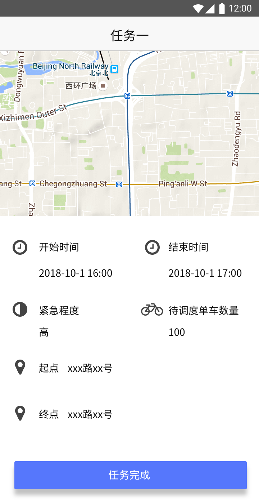
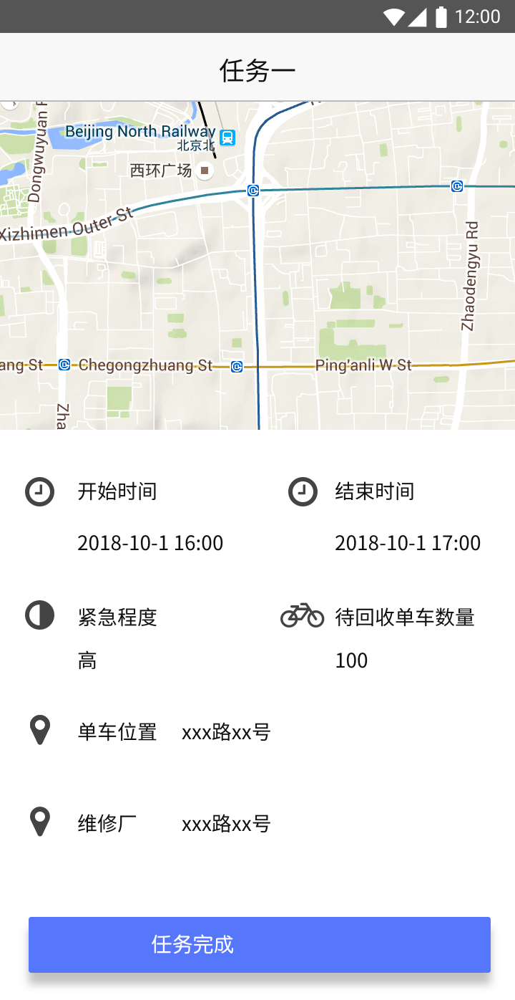
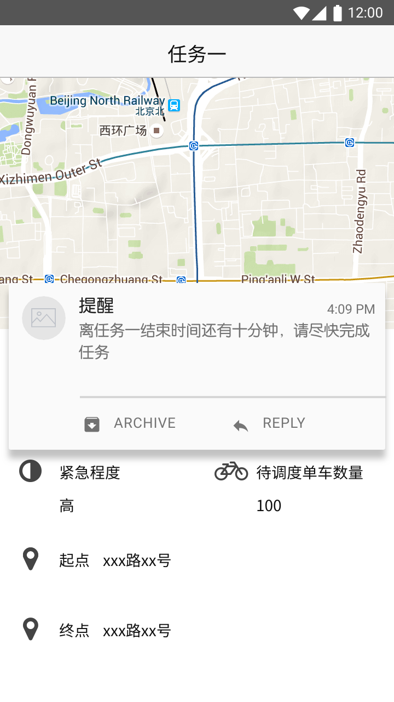
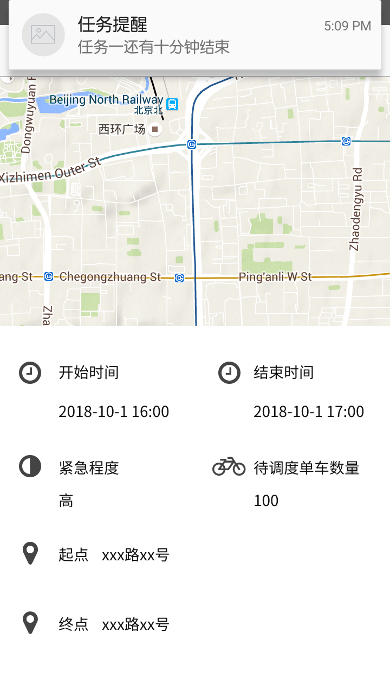
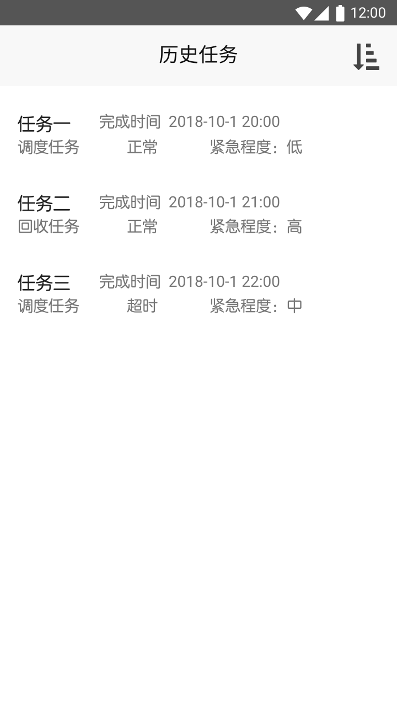
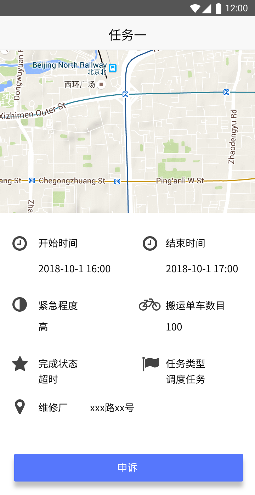

# 需求规格说明文档

## 详细需求描述

### 用户界面

系统中部分重要界面如下

#### Part1：搬车工人移动端 APP

- UI1：查看当前调度任务

  

  列表中的任务按照截止时间的先后顺序进行排序

  UI1.1：点击某个列表项进入 UI2 ，查看任务详细信息

- UI2：调度任务详情界面

  

  地图中将显示起点和终点的位置以及规划的路线。起点可以为多处，触碰以列表形式展开；地图上会显示出各个单车的具体位置

  UI2.1：触碰 `开始时间` 或 `结束时间` 处会显示弹窗，弹窗的内容是距离任务结束的时间（小时和分钟）

  UI2.2：点击任务完成应该出现一个 “确认是否完成” 的再次确认界面

  UI2.3：当任务剩余时间不足或者任务已经超时，参照 UI5

- UI3：回收任务列表界面

  

  显示当前未完成的回收任务，每一项将显示任务代号、任务截止时间

  UI3.1：触碰列表中的任务项将进入 UI4 ，“回收任务详情界面”

- UI4：回收任务详情界面

  

  地图中将显示待回收单车片区的位置、单车维修厂的位置以及规划的路线，点击地图后将显示每个单车的具体位置；触碰结束时间将显示弹窗，提示距离结束还有多少时间（小时和分钟）；触碰任务完成会出现弹窗要求用户再次确认

  UI4.1：当任务剩余时间过少或任务超时未完成时将会有消息提示，参照 UI5

- UI5：消息提示

  图一

  

  图二

  

  出现需要通知用户的消息时，当用户正处在 app 内时将显示如图一所示的提示信息；当用户不在 app 内时将显示如图二所示的提示信息

- UI6：历史任务列表

  

  每个列表项将显示任务代号、完成时间、任务类型（回收任务或调度任务）、任务完成状态（正常、超时、申诉中）以及任务的紧急程度（低、中、高）；触碰右上角的图表将显示排序和筛选选项，选择排序维度和筛选条件后确认即可得到排序和筛选之后的列表

  UI6.1：触碰某个列表项将进入历史任务的详细信息界面，参考 UI7

- UI7：历史任务详细信息界面

  

  地图上将显示未搬运前单车位置和维修厂位置；只有当完成状态为“超时”时，才可以触碰“申诉”按钮

  UI7.1：触碰申诉按钮将显示申诉表单，要求填写申诉理由
### 搬车工人管理当前调度任务

#### 刺激/响应序列

刺激：用户发起查询当前调度任务请求

响应：系统返回用户当前调度任务的列表

刺激：用户请求查询某个调度任务详细信息

响应：系统返回该调度任务详细信息

刺激：用户发起调度任务提交申请

响应：系统记录任务完成信息，并提示任务提交成功

刺激：用户在任务截止时间前 10 分钟没有提交任务

响应：系统显示提示信息，提醒用户提交任务

刺激：用户超出任务截止时间 10 分钟未提交任务，系统记录任务超时信息并提示用户尽快完成任务

| 需求                            | 描述                                                         |
| ------------------------------- | ------------------------------------------------------------ |
| Carrier.Dispath.List            | 系统应该允许用户查看当前任务                                 |
| Carrier.Dispath.Details         | 系统能够显示正在进行的调度任务的详细信息，包括：任务发布时间、任务截止时间、任务紧急程度、待调度单⻋位置信息和数量信息、调度⽬的地位置信息以及建议的路线 |
| Carrier.Dispath.Commit          | 系统应该允许用户提交任务                                     |
| Carrier.Dispath.Alert           | 系统应该能够在某任务剩余时间少于十分钟时显示提示信息，提醒用户尽快完成任务；能够在用户超出某任务规定完成时间十分钟后提醒用户任务已经超时 |
| Record.Carrier.Dispath.Overtime | 系统能够记录用户超时的任务 ID，该任务超时发生的具体时间，超时发生时用户所在地点信息 |
| Record.Carrier.Dispath.Complete | 系统应该记录用户提交任务时的信息，包括任务的ID、任务完成时间、任务完成时用户地点信息 |

### 搬车工人管理当前回收任务

#### 刺激/响应序列

刺激：用户请求查看当前的回收任务列表

响应：系统显示正在进行的回收任务列表

刺激：用户请求查看某个任务的详细信息

响应：系统显示该任务的详细信息

刺激：用户请求提交当前回收任务

响应：系统记录提交信息，显示提交成功，等待车辆管理员确认

刺激：车辆管理员确认用户完成任务的提交

响应：系统记录确认信息，显示确认成功，并提醒用户任务完成

刺激：某回收任务剩余时间少于十分钟

响应：系统提醒用户任务时间少于十分钟，请尽快和车辆管理员确认提交

刺激：某回收任务超出截止时间十分钟用户未提交

响应：系统记录任务超时信息，提醒用户任务已经超时，请尽快完成任务

刺激：某回收任务超出截止时间十分钟，用户已经提交任务但是车辆管理员未确认

响应：系统记录任务超时信息，提醒用户任务超时，提醒车辆管理员对用户的任务进行确认

#### 相关功能需求

| 需求                            | 描述                                                         |
| ------------------------------- | ------------------------------------------------------------ |
| Carrier.Recycle.List            | 系统应该允许用户查看当前正在进行的回收任务列表信息           |
| Carrier.Recycle.Details         | 系统应该允许用户查看某任务的详细信息，包括：任务发布时间、任务截止时间、任务紧急程度、待回收单车位置及数量信息、目标维修厂位置信息、建议的路线 |
| Carrier.Recycle.Commit          | 系统应该允许用户提交当前的任务                               |
| Carrier.Recycle.AdminVerify     | 系统应该允许车辆管理员对用户提交的任务进行确认               |
| Carrier.Recycle.Alert           | 系统能够在某未提交任务距离截止时间还剩十分钟时提醒用户尽快完成任务，能够在某未提交任务超出截止时间十分钟后提醒用户该任务已经超时；能够在某以提交单未确认任务超出截止时间十分钟后提醒该用户任务已超时，提醒车辆管理员联系工人进行任务完成确认 |
| Record.Carrier.Recycle.Overtime | 系统能够记录某任务超时发生的时间、超时发生时用户所在的地点   |
| Record.Carrier.Recycle.Commit   | 系统能够记录用户的任务提交信息，包括提交时间、提交时工人的位置 |
| Record.Carrier.Recycle.Complete | 系统能够记录车辆管理员对工人提交的任务进行确认的信息，包括确认时间 |

### 搬车工人发起申请

#### 刺激/响应序列

刺激：搬车工人申请延长某未完成任务的截止时间

响应：系统显示延长任务时限申请表单

刺激：搬车工人填写延长任务时限申请表单并请求提交

响应：系统记录申请请求，并显示申请提交成功

刺激：搬车工人申请放弃某未完成任务

响应：系统显示放弃任务申请表单

刺激：搬车工人填写申请表并请求提交

响应：系统记录申请提交，并显示申请提交成功

刺激：搬车工人请求对某历史超时任务提起申诉

响应：系统显示申诉表单

刺激：搬车工人填写申诉表单并请求提交

响应：系统记录申诉请求，并显示申诉提交成功

刺激：搬车工人某申请审核完毕

响应：系统提示工人申请审核完毕并显示申请结果

#### 相关功能需求

| 需求                        | 描述                                                         |
| --------------------------- | ------------------------------------------------------------ |
| Carrier.Application.Prolong | 系统应该允许用户发出延长任务申请，申请需要填写的信息包括：延长时间、申请理由 |
| Carrier.Application.Abandon | 系统应该允许用户发出放弃任务的申请，申请需要填写的信息包括：放弃任务理由 |
| Carrier.Application.History | 系统应该允许用户对历史超时任务发起申诉，申诉需要填写的信息包括：申诉理由 |
| Record.Carrier.Application  | 系统应该记录用户提交的申请信息，具体包括：申请人ID，申请类型（延长任务时限、放弃任务、历史任务申诉），用户填写的申请信息，用户申请的任务ID，用户申请提交的时间 |
| Carrier.Application.Result  | 系统能够提醒用户该用户发出的申请的审核结果                   |

### 车辆管理员确认车辆回收

#### 刺激/响应序列

刺激：车辆管理员请求查看待确认回收任务

响应：系统显示待确认回收任务列表

刺激：车辆管理员请求对某个待确认回收任务进行确认

响应：系统记录确认结果并提示确认成功

#### 相关功能需求

| 需求                 | 描述                                                         |
| -------------------- | ------------------------------------------------------------ |
| Admin.Recycle.Verify | 系统应该允许用户对待确认回收任务（工人已经提交但未确认的车辆回收任务）进行确认 |
| Admin.Recycle.List   | 系统应该允许用户查看当前待确认的回收任务列表                 |
| Record.Admin.Recycle | 系统应该能够记录用户对某个回收任务的确认                     |

### 搬车工人管理历史任务

#### 刺激/响应序列

刺激：用户请求查看历史任务列表

响应：系统按照任务完成的时间顺序显示用户的历史任务

刺激：用户请求查看某个历史调度任务的详细信息

响应：系统显示该历史调度任务的详细信息

刺激：用户请求查看某个历史回收任务的详细信息

响应：系统显示该历史回收任务的详细信息

刺激：用户选择筛选和排序维度请求对历史任务进行筛选和排序

响应：系统显示筛选和排序后的任务列表

刺激：用户请求查看历史任务统计信息

响应：系统显示该用户的历史任务统计信息

#### 相关功能需求

| 需求                           | 描述                                                         |
| ------------------------------ | ------------------------------------------------------------ |
| Carrier.History.List           | 系统应该允许用户查看历史任务列表信息，列表项的信息包括：任务 ID ，任务类型（调度任务、回收任务），任务的完成状态（正常、超时、放弃），任务紧急程度（低、中、高） |
| Carrier.History.Detail.Dispath | 系统应该允许用户查看历史调度任务的详细信息，包括：任务发布时间、任务完成时间、任务紧急程度、任务完成状态、调度前单车位置信息、调度目的地位置信息 |
| Carrier.History.Detail.Recycle | 系统应该允许用户查看历史回收任务的详细信息，包括：任务发布时间、任务完成时间、任务紧急程度、任务完成状态、回收前单车位置信息、目的维修厂位置信息 |
| Carrier.History.Filter         | 系统应该允许用户对历史任务列表进行筛选，筛选的条件包括：任务类型，任务完成状态、任务紧急程度 |
| Carrier.History.Sort           | 系统应该允许用户对历史任务列表进行排序，排序的维度包括：任务发布时间、任务完成时间、任务紧急程度 |
| Carrier.History.Statistics     | 系统应该允许用户查看历史任务的统计信息，包括任务完成情况统计（正常、超时和放弃的任务数量）、任务完成用时统计（平均用户、最大用时、最短用时） |

### 管理员（车辆、调度）处理申请

#### 刺激/响应序列

刺激：工人提交申请（申请的种类有：延长任务申请、放弃任务申请、历史超时任务申诉）

响应：系统提示管理员处理新的申请

刺激：管理员请求查看申请列表

响应：系统显示申请列表

刺激：管理员请求查看某申请详情

响应：系统显示该申请详细信息

刺激：管理员请求对申请进行处理

响应：系统显示处理申请的表单

刺激：管理员填写表单后请求提交

响应：系统保存管理员处理结果并显示提交成功

#### 相关需求功能

| 需求                            | 描述                                                         |
| ------------------------------- | ------------------------------------------------------------ |
| Admin.Application.List          | 系统应该允许管理员查看当前的申请列表                         |
| Admin.Application.Detail        | 系统应该允许管理员查看某个申请的详细信息，包括：申请类型（延长任务申请、放弃任务申请、历史超时任务申诉），申请发起时间，申请人，申请理由 |
| Admin.Application.Check         | 系统应该允许管理员填写处理结果表单，表单的内容包括：处理人（自动生成）、处理结果（同意、不同意）、处理理由 |
| Admin.Application.Alert         | 系统应该对工人在近 1 分钟内提交的新的申请对管理员通过发送通知的方式进行提示 |
| Record.Admin.Application.Result | 系统应该对管理员处理的申请进行记录，包括：处理结果表单内容和申请表单内容 |

### 用户反馈

#### 刺激/响应序列

刺激：用户请求进行反馈

响应：系统显示反馈表单

刺激：用户填写表单后确认提交

响应：系统显示提交成功

刺激：用户取消进行反馈

响应：系统返回主界面

#### 相关功能需求

| 需求                  | 描述                                                         |
| --------------------- | ------------------------------------------------------------ |
| User.Feedback.Content | 系统应该允许用户填写反馈表单，表单的内容包括：等级评价（分为 5 个等级，数字越大体验越好）、文字评价 |
| User.Feedback.Commit  | 系统应该允许用户提交反馈                                     |
| User.Feedback.Cancel  | 系统应该允许用户取消反馈                                     |
| Record.User.Feedback  | 系统应该能够记录用户的反馈，记录的信息包括：用户填写的表单、用户 ID 、填写时间 |

### 易用性

Usability1 : 系统应该同时提供模块化和表格化的视图

Usability2 : 系统的 app 的字体大小应可变更

### 业务规则

- 搬车工人管理当前调度任务（工人选择一个还未完成的调度任务，查看详细信息）
- 搬车工人管理当前回收任务（工人选择一个还未完成的回收任务，查看详细信息）
- 搬车工人发起申请（工人向管理员发起“任务延时”、“放弃任务”、“超时任务申诉”的申请）
- 搬车工人管理历史任务（工人查看历史任务信息）
- 车辆管理员确认车辆回收（车辆管理员对工人完成的回收车辆任务进行确认）
- 管理员（车辆、调度）处理申请（管理员处理工人发出的“任务延时”、“放弃任务”、“超时任务申诉”的申请）
- 用户反馈（单车用户填写反馈信息）

### 安全性

Safety1：系统按照用户身份验证用户的访问权限

- 搬车工人有管理当前调度任务、管理当前回收任务、发起申请、管理历史任务四个功能
- 用户有反馈功能（除去已有系统的功能外）

### 默认数据

Default1：工人当前任务列表中的任务默认按照任务截止时间先后顺序进行排序

Default2：工人历史任务列表中的任务默认按照任务完成时间先后顺序进行排序

### 数据格式要求

Format1：工人调度任务详细信息包括：任务发布时间、任务截止时间、任务紧急程度、待调度单⻋位置信息和数量信息、调度⽬的地位置信息以及建议的路线

Format2：工人回收任务详细信息包括：任务发布时间、任务截止时间、任务紧急程度、待回收单车位置及数量信息、目标维修厂位置信息、建议的路线

Format3：搬车工人申请表单信息包括

- 延长任务申请表单：延长时间、申请理由
- 放弃任务申请表单：申请理由
- 超时任务申诉表单：申诉理由

Format4：用户反馈表单信息包括：等级评价（分为 5 个等级，数字越大体验越好）、文字评价

Format5：工人历史任务列表项信息包括：任务 ID ，任务类型（调度任务、回收任务），任务的完成状态（正常、超时、放弃），任务紧急程度（低、中、高）