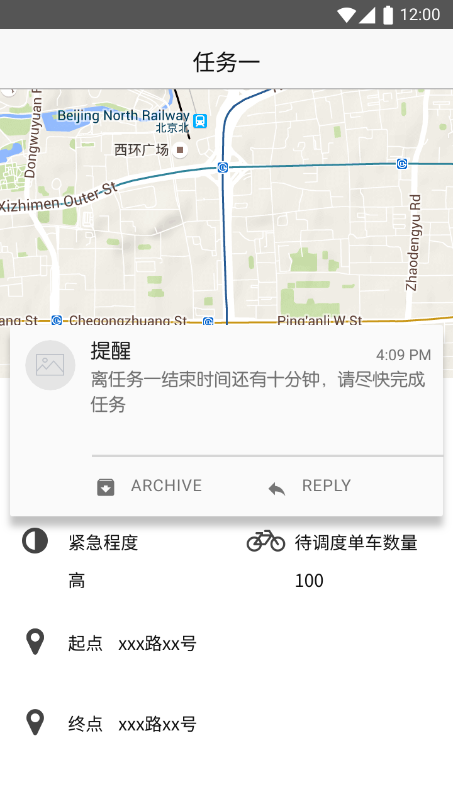
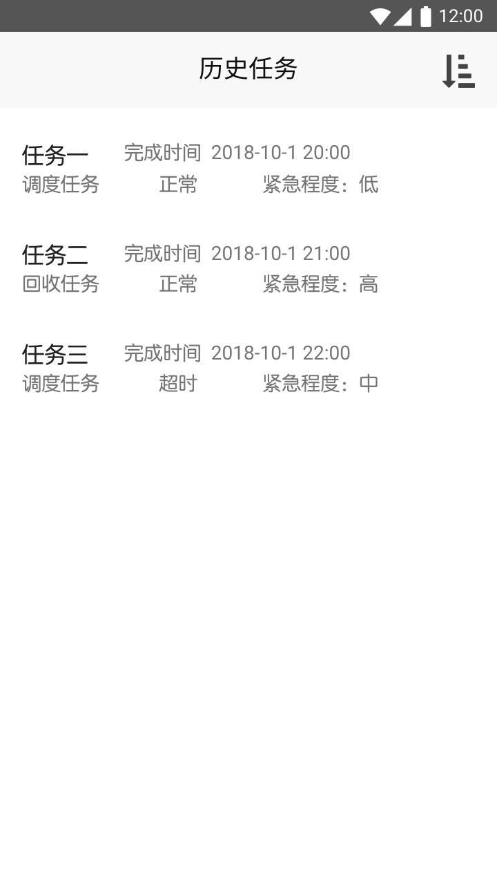
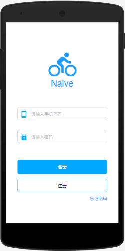
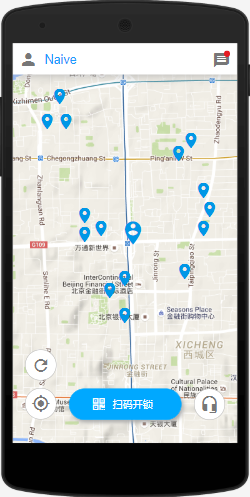
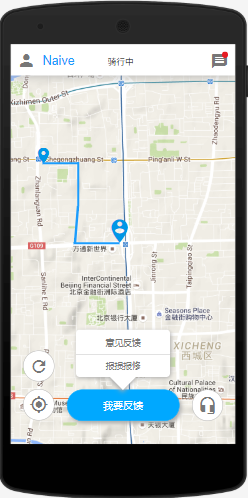
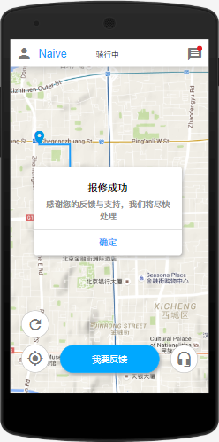
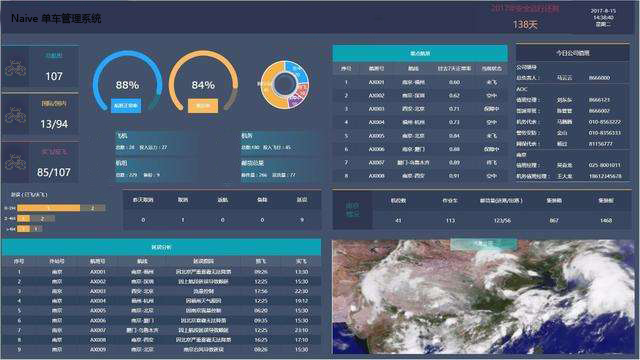

# 需求规格说明文档

### 更新历史

| 修改人员           | 日期         | 变更原因   | 版本号  |
| -------------- | ---------- | ------ | ---- |
| 陈俊宇、高梦婷、廖均达、訾源 | 2018-11-8  | 初稿     | 0.01 |
| 廖均达            | 2018-11-11 | 整合     | 0.1  |
| 訾源             | 2018-11-13 | 修复图片路径 | 1.0  |

## 目录

[TOC]

## 引言

### 目的

本文档是对共享单车调度、回收管理系统的需求规格说明，本文档将供用户方和系统开发团队使用。

### 范围

该企业配备了新的系统之后，能够保证提升⽤户体验，解决⽤⻋车难、⻋车辆损坏严重的问题，增加市场 份额和公司收⼊。

单⻋车⽤户可以通过新加的⻋车辆报修功能来向单⻋车公司提供损坏⻋车辆的信息，⼀旦核实便可以得到退款 甚⾄红包奖励，极⼤地优化了⽤户体验。

系统新增了⻋车辆调度⼦系统，可以根据历史⽤⻋车信息实时估计各地区单⻋车需求量，同时⻋车辆调度⼈员 安排⻋车辆搬运任务，⼤⼤优化了共享单⻋车的资源配置，“⼩区⻔门⼝⻋车辆堆积成⼭，地铁⼝⼀⻋车难求”的 现象不会再出现，可以更加充分有效的利⽤有限的共享单⻋车。

系统新增了报修请求处理系统，可以根据⽤户报修信息以及⻋车辆使⽤历史信息精确估计⻋车辆状况，向 ⻋车辆调度⼈员发派任务，回收废弃⻋车辆，修理故障⻋车辆。同时，系统还会定期要求⻋车辆调度⼈员回收 正常⼯作的⻋车辆，对其进⾏保养。预期会⼤⼤提升共享单⻋车的可⽤率。

最终，该系统能够提⾼软件流量、扩⼤市场份额、提升公司⼝碑，最终使得公司能够得到更多的利 润，蓬勃健康发展。

### 参考文献

需求工程:软件建模与分析，骆斌、丁二玉，高等教育出版社， 2009-04-01， ISBN：9787040262957

## 总体描述

### 商品前景

目前Naive单车公司面临的主要问题是：在⼈流量较⼤的地⽅，共享单⻋数量稀少，而在附近的居民区，共享单⻋则数量较多甚至过多，共享单车不能得到充分的利用。同时，单⻋车损坏率较高，公司缺少对单车的保养和维修，没有设置用户反馈的途径，用户对单车的使用体验较低。

#### 业务机遇

该企业配备了新的系统之后，能够保证提升⽤户体验，解决⽤⻋车难、⻋车辆损坏严重的问题，增加市场份额和公司收⼊。

单⻋车⽤户可以通过新加的⻋车辆报修功能来向单⻋车公司提供损坏⻋车辆的信息，⼀旦核实便可以得到退款 甚⾄红包奖励，极⼤地优化了⽤户体验。

系统新增了⻋车辆调度⼦系统，可以根据历史⽤⻋车信息实时估计各地区单⻋车需求量，同时⻋车辆调度⼈员 安排⻋车辆搬运任务，⼤⼤优化了共享单⻋车的资源配置，“⼩区⻔门⼝⻋车辆堆积成⼭，地铁⼝⼀⻋车难求”的 现象不会再出现，可以更加充分有效的利⽤有限的共享单⻋车。

系统新增了报修请求处理系统，可以根据⽤户报修信息以及⻋车辆使⽤历史信息精确估计⻋车辆状况，向 ⻋车辆调度⼈员发派任务，回收废弃⻋车辆，修理故障⻋车辆。同时，系统还会定期要求⻋车辆调度⼈员回收 正常⼯作的⻋车辆，对其进⾏保养。预期会⼤⼤提升共享单⻋车的可⽤率。

最终，该系统能够提⾼软件流量、扩⼤市场份额、提升公司⼝碑，最终使得公司能够得到更多的利 润，蓬勃健康发展。

#### 业务需求

BR1：在调度管理人员自行制定车辆调度任务时候，调度管理人员可以选择并且查看选定地区的车辆分布状况

BR2：在调度管理人员自行制定车辆调度任务时候，调度管理人员可以选择并且查看选定地区、时间段的系统自动生成的预期车辆需求状况

BR3：调度管理人员可以查看当前的选定地区的调度管理任务的信息，并且可以选择具体的某个任务，查看其详细信息

BR4：调度管理人员可以增加、修改、删除选定地区的调度管理任务。

BR5：调度管理人员要求系统自动根据车辆当前分布状况、未来车辆预期需求状况自动化的生成调度管理任务。

BR6：调度管理人员和车辆管理人员要能够通过系统处理车辆搬运工人对失败任务的申诉请求。

BR7：共享单车用户可以使用系统对使用的满意度以及意见或建议进行反馈

BR8：车辆搬运工人可以查看自己当前的调度任务列表，并能够选择具体任务查看详细信息

BR9：车辆搬运工人可以查看自己当前的回收任务列表，并能够选择具体任务查看详细信息

BR10：车辆搬运工人可以查看自己完成的历史任务，并能够对判定为失败的历史任务提起申诉

BR11：车辆搬运工人可以向调度管理员申请调度任务截止时间延长或是将任务转让出去，可以向车辆管理员申请回收任务截止时间延长或是将任务转让出去。

BR12：调度管理员及车辆管理员能够处理车辆搬运工人提出的任务时间延长或转让请求

BR13：车辆搬运工人能够查看自己的历史任务统计信息

BR14：车辆管理人员在管理车辆时可以查看公司所有共享单车的信息

BR15：车辆管理人员可以增加，修改车辆信息

BR16：车辆管理人员可以查看所有车辆回收任务列表，并可以选择具体任务查看具体信息

BR17：车辆管理人员可以对车辆搬运工人完成的车辆回收任务进行结算

BR18：共享单车用户可以使用系统对已经损坏的共享单车进行报修

BR19：经理可以通过系统查看各个数据报表

### 假设和依赖

AS-1：公司能够招募⾜够的共享单⻋车搬运⼯⼈ 

AS-2：⽤户有使⽤⽹络以及本软件的相关技能 

AS-3：共享单⻋车搬运⼯⼈采⽤的是较⼤的⻋车⼦来运输单⻋车 

AS-4：⽤户的数量规模有⼀个最⼤上限，最⼤信息存储空间⼀定 

AS-5：⼤部分⽤户在本意上还是愿意帮助提供报修反馈

## 详细需求描述

### 对外接口需求

#### 用户界面

系统中部分重要界面如下：

##### Part1：搬车工人移动端 APP

- UI1：查看当前调度任务

  

  列表中的任务按照截止时间的先后顺序进行排序

  UI1.1：点击某个列表项进入 UI2 ，查看任务详细信息

- UI2：调度任务详情界面

  

  地图中将显示起点和终点的位置以及规划的路线。起点可以为多处，触碰以列表形式展开；地图上会显示出各个单车的具体位置

  UI2.1：触碰 `开始时间` 或 `结束时间` 处会显示弹窗，弹窗的内容是距离任务结束的时间（小时和分钟）

  UI2.2：点击任务完成应该出现一个 “确认是否完成” 的再次确认界面

  UI2.3：当任务剩余时间不足或者任务已经超时，参照 UI5

- UI3：回收任务列表界面

  

  显示当前未完成的回收任务，每一项将显示任务代号、任务截止时间

  UI3.1：触碰列表中的任务项将进入 UI4 ，“回收任务详情界面”

- UI4：回收任务详情界面

  

  地图中将显示待回收单车片区的位置、单车维修厂的位置以及规划的路线，点击地图后将显示每个单车的具体位置；触碰结束时间将显示弹窗，提示距离结束还有多少时间（小时和分钟）；触碰任务完成会出现弹窗要求用户再次确认

  UI4.1：当任务剩余时间过少或任务超时未完成时将会有消息提示，参照 UI5

- UI5：消息提示

  图一

  

  图二

  

  出现需要通知用户的消息时，当用户正处在 app 内时将显示如图一所示的提示信息；当用户不在 app 内时将显示如图二所示的提示信息

- UI6：历史任务列表

  

  每个列表项将显示任务代号、完成时间、任务类型（回收任务或调度任务）、任务完成状态（正常、超时、申诉中）以及任务的紧急程度（低、中、高）；触碰右上角的图表将显示排序和筛选选项，选择排序维度和筛选条件后确认即可得到排序和筛选之后的列表

  UI6.1：触碰某个列表项将进入历史任务的详细信息界面，参考 UI7

- UI7：历史任务详细信息界面

  

  地图上将显示未搬运前单车位置和维修厂位置；只有当完成状态为“超时”时，才可以触碰“申诉”按钮

  UI7.1：触碰申诉按钮将显示申诉表单，要求填写申诉理由

##### Part2：调度管理员客户端界面

- UI8：车辆分布状况

  查看车辆分布状况界面分成两个部分，位置选择部分和显示部分。

  点击`+` 或者 `-`可以对地图京放大或缩小。

  拖拽地图可以切换到周围显示区域。

​	UI8.1：鼠标移动到地图上可以看到某地区具体的车辆分布状况。

​	UI8.2：点击位置选择那的小按钮可以进入选择地区界面

- UI9：车辆预期需求

  整体情况和UI8类似。

  

  UI9.1：鼠标移动到地图上可以看到某地区具体的预期车辆需求。

  UI9.2：点击位置选择那的小按钮可以进入选择地区界面

- UI10：查看调度管理任务

  

  UI10.1：点击开始时间/结束时间可以选择时间

  UI10.2：点击位置选择那的小按钮可以进入选择地区界面

  UI10.3：点击下面的页码号可以切换页面

  UI10.4：点击左侧列表中的项可以切换右部表单

- UI11：管理调度任务

  

  整体情况和UI3的下属子页面相似。

  UI11.1：点击`+`号可以进入添加任务界面

  UI11.2：点击`-`号会提示删除任务

  UI11.3：点击`笔`或进入修改任务界面。

##### Part3：车辆管理人员客户端界面

- UI12：车辆管理界面
  UI12.1 用户进入车辆管理模块

  

  UI12.2 车辆管理员点击左上角状态下拉框即可对列表进行筛选

  

  UI12.3 车辆管理人员点击右上角添加车辆系统即可添加车辆

  

  UI12.4 车辆管理人员点击车辆信息后的删除按钮即可删除该车辆

  

  UI12.5 车辆管理人员点击状态为维修中的车辆后的更新按钮即可更新车辆维修状态

- UI13：管理车辆回收任务
  UI13.1用户进入管理车辆回收任务模块

  

  UI13.2 用户点击某个具体的任务查看该任务的详细信息

  

  UI13.3 当任务状态为待结算时，点击结算按钮即可对任务进行结算

##### Part4：共享单车用户移动端APP界面

- UI14：登录界面

  需要用户首先输入账号（手机号码）和密码以使用该APP，若用户曾经登录过，那么默认自动登录。如果用户登录成功，那么转向界面UI2

​	UI14.1：用户如果没有账号，可以点击注册进入一个注册界面以注册账号

​	UI14.2：用户如果忘记账号密码，可以点击忘记密码进入找回密码界面通过绑定的手机找回账号密码

- UI15：首页

  用户登录后默认显示的界面

  地图中的大标记显示的是用户所在的位置，小标记显示的是单车所在的位置。用户可以对地图进行放大和缩小寻找合适的单车。点击左下角的刷新图标之后对当前页面进行刷新和重加载，点击左下角的定位图标之后地图将以个人位置为中心。

​	UI15.1：点击扫码开锁之后，跳转至界面UI16

​	UI15.2：点击左上角个人图标之后显示个人信息界面

​	UI15.3：点击右上角消息图标之后显示用户收到的消息界面

​	UI15.4：点击右下角的客服图标之后显示客服咨询界面

- UI16：扫码开锁界面

  用户选择扫码开锁后显示的界面

  点击轻触点亮之后打开手电筒

​	UI16.1：当识别框对准单车上的二维码并识别成功后，单车开锁，跳转至UI17界面

​	UI16.2：点击左上角的返回图标时，返回首页UI15界面

- UI17：骑行界面（含报修）

  识别单车成功并开锁之后显示的骑行界面

  刷新按钮、定位按钮、客服按钮、个人图标与消息图标的作用与首页UI2中相同。地图中的小标记是单车开锁的位置（出发位置），大标记是当前单车的位置。蓝色的线条记录着当前单车行驶的轨迹。点击我要反馈后，会出现意见反馈和报损报修选项。

​	UI17.1：点击意见反馈后，跳转到意见反馈界面UI16

​	UI17.2：点击报损报修后，提示是否成功信息

- UI18：意见反馈界面

  点击小星星为我们打分（用户满意度），在输入框中输入意见

​	UI18.1：点击提交并成功之后，返回骑行界面UI17

​	UI18.2：点击左上角的返回图标之后，放弃意见反馈并返回骑行界面UI17

##### Part6：公司经理客户端界面

- UI19：查看报表

  查看报表界面提供展示：用车数据报表、用户反馈评价报表、用户报损报修数据报表、财务数据报表、各类任务信息报表、车辆分布数据报表，可点击查看各个报表展示详细信息，并提供数据可视化展示。

#### 软件接口

SI：使用 MySql 作为底层数据库存储各种数据。

### 功能描述

#### 搬车工人管理当前调度任务

##### 刺激/响应序列

刺激：用户发起查询当前调度任务请求

响应：系统返回用户当前调度任务的列表

刺激：用户请求查询某个调度任务详细信息

响应：系统返回该调度任务详细信息

刺激：用户发起调度任务提交申请

响应：系统记录任务完成信息，并提示任务提交成功

刺激：用户在任务截止时间前 10 分钟没有提交任务

响应：系统显示提示信息，提醒用户提交任务

刺激：用户超出任务截止时间 10 分钟未提交任务，系统记录任务超时信息并提示用户尽快完成任务

##### 相关功能需求

| 需求                              | 描述                                       |
| ------------------------------- | ---------------------------------------- |
| Carrier.Dispath.List            | 系统应该允许用户查看当前任务                           |
| Carrier.Dispath.Details         | 系统能够显示正在进行的调度任务的详细信息，包括：任务发布时间、任务截止时间、任务紧急程度、待调度单⻋位置信息和数量信息、调度⽬的地位置信息以及建议的路线 |
| Carrier.Dispath.Commit          | 系统应该允许用户提交任务                             |
| Carrier.Dispath.Alert           | 系统应该能够在某任务剩余时间少于十分钟时显示提示信息，提醒用户尽快完成任务；能够在用户超出某任务规定完成时间十分钟后提醒用户任务已经超时 |
| Record.Carrier.Dispath.Overtime | 系统能够记录用户超时的任务 ID，该任务超时发生的具体时间，超时发生时用户所在地点信息 |
| Record.Carrier.Dispath.Complete | 系统应该记录用户提交任务时的信息，包括任务的ID、任务完成时间、任务完成时用户地点信息 |

#### 搬车工人管理当前回收任务

##### 刺激/响应序列

刺激：用户请求查看当前的回收任务列表

响应：系统显示正在进行的回收任务列表

刺激：用户请求查看某个任务的详细信息

响应：系统显示该任务的详细信息

刺激：用户请求提交当前回收任务

响应：系统记录提交信息，显示提交成功，等待车辆管理员确认

刺激：车辆管理员确认用户完成任务的提交

响应：系统记录确认信息，显示确认成功，并提醒用户任务完成

刺激：某回收任务剩余时间少于十分钟

响应：系统提醒用户任务时间少于十分钟，请尽快和车辆管理员确认提交

刺激：某回收任务超出截止时间十分钟用户未提交

响应：系统记录任务超时信息，提醒用户任务已经超时，请尽快完成任务

刺激：某回收任务超出截止时间十分钟，用户已经提交任务但是车辆管理员未确认

响应：系统记录任务超时信息，提醒用户任务超时，提醒车辆管理员对用户的任务进行确认

##### 相关功能需求

| 需求                              | 描述                                       |
| ------------------------------- | ---------------------------------------- |
| Carrier.Recycle.List            | 系统应该允许用户查看当前正在进行的回收任务列表信息                |
| Carrier.Recycle.Details         | 系统应该允许用户查看某任务的详细信息，包括：任务发布时间、任务截止时间、任务紧急程度、待回收单车位置及数量信息、目标维修厂位置信息、建议的路线 |
| Carrier.Recycle.Commit          | 系统应该允许用户提交当前的任务                          |
| Carrier.Recycle.AdminVerify     | 系统应该允许车辆管理员对用户提交的任务进行确认                  |
| Carrier.Recycle.Alert           | 系统能够在某未提交任务距离截止时间还剩十分钟时提醒用户尽快完成任务，能够在某未提交任务超出截止时间十分钟后提醒用户该任务已经超时；能够在某以提交单未确认任务超出截止时间十分钟后提醒该用户任务已超时，提醒车辆管理员联系工人进行任务完成确认 |
| Record.Carrier.Recycle.Overtime | 系统能够记录某任务超时发生的时间、超时发生时用户所在的地点            |
| Record.Carrier.Recycle.Commit   | 系统能够记录用户的任务提交信息，包括提交时间、提交时工人的位置          |
| Record.Carrier.Recycle.Complete | 系统能够记录车辆管理员对工人提交的任务进行确认的信息，包括确认时间        |

#### 搬车工人发起申请

##### 刺激/响应序列

刺激：搬车工人申请延长某未完成任务的截止时间

响应：系统显示延长任务时限申请表单

刺激：搬车工人填写延长任务时限申请表单并请求提交

响应：系统记录申请请求，并显示申请提交成功

刺激：搬车工人申请放弃某未完成任务

响应：系统显示放弃任务申请表单

刺激：搬车工人填写申请表并请求提交

响应：系统记录申请提交，并显示申请提交成功

刺激：搬车工人请求对某历史超时任务提起申诉

响应：系统显示申诉表单

刺激：搬车工人填写申诉表单并请求提交

响应：系统记录申诉请求，并显示申诉提交成功

刺激：搬车工人某申请审核完毕

响应：系统提示工人申请审核完毕并显示申请结果

##### 相关功能需求

| 需求                          | 描述                                       |
| --------------------------- | ---------------------------------------- |
| Carrier.Application.Prolong | 系统应该允许用户发出延长任务申请，申请需要填写的信息包括：延长时间、申请理由   |
| Carrier.Application.Abandon | 系统应该允许用户发出放弃任务的申请，申请需要填写的信息包括：放弃任务理由     |
| Carrier.Application.History | 系统应该允许用户对历史超时任务发起申诉，申诉需要填写的信息包括：申诉理由     |
| Record.Carrier.Application  | 系统应该记录用户提交的申请信息，具体包括：申请人ID，申请类型（延长任务时限、放弃任务、历史任务申诉），用户填写的申请信息，用户申请的任务ID，用户申请提交的时间 |
| Carrier.Application.Result  | 系统能够提醒用户该用户发出的申请的审核结果                    |

#### 车辆管理员确认车辆回收

##### 刺激/响应序列

刺激：车辆管理员请求查看待确认回收任务

响应：系统显示待确认回收任务列表

刺激：车辆管理员请求对某个待确认回收任务进行确认

响应：系统记录确认结果并提示确认成功

##### 相关功能需求

| 需求                   | 描述                                      |
| -------------------- | --------------------------------------- |
| Admin.Recycle.Verify | 系统应该允许用户对待确认回收任务（工人已经提交但未确认的车辆回收任务）进行确认 |
| Admin.Recycle.List   | 系统应该允许用户查看当前待确认的回收任务列表                  |
| Record.Admin.Recycle | 系统应该能够记录用户对某个回收任务的确认                    |

#### 搬车工人管理历史任务

##### 刺激/响应序列

刺激：用户请求查看历史任务列表

响应：系统按照任务完成的时间顺序显示用户的历史任务

刺激：用户请求查看某个历史调度任务的详细信息

响应：系统显示该历史调度任务的详细信息

刺激：用户请求查看某个历史回收任务的详细信息

响应：系统显示该历史回收任务的详细信息

刺激：用户选择筛选和排序维度请求对历史任务进行筛选和排序

响应：系统显示筛选和排序后的任务列表

刺激：用户请求查看历史任务统计信息

响应：系统显示该用户的历史任务统计信息

##### 相关功能需求

| 需求                             | 描述                                       |
| ------------------------------ | ---------------------------------------- |
| Carrier.History.List           | 系统应该允许用户查看历史任务列表信息，列表项的信息包括：任务 ID ，任务类型（调度任务、回收任务），任务的完成状态（正常、超时、放弃），任务紧急程度（低、中、高） |
| Carrier.History.Detail.Dispath | 系统应该允许用户查看历史调度任务的详细信息，包括：任务发布时间、任务完成时间、任务紧急程度、任务完成状态、调度前单车位置信息、调度目的地位置信息 |
| Carrier.History.Detail.Recycle | 系统应该允许用户查看历史回收任务的详细信息，包括：任务发布时间、任务完成时间、任务紧急程度、任务完成状态、回收前单车位置信息、目的维修厂位置信息 |
| Carrier.History.Filter         | 系统应该允许用户对历史任务列表进行筛选，筛选的条件包括：任务类型，任务完成状态、任务紧急程度 |
| Carrier.History.Sort           | 系统应该允许用户对历史任务列表进行排序，排序的维度包括：任务发布时间、任务完成时间、任务紧急程度 |
| Carrier.History.Statistics     | 系统应该允许用户查看历史任务的统计信息，包括任务完成情况统计（正常、超时和放弃的任务数量）、任务完成用时统计（平均用户、最大用时、最短用时） |

#### 管理员（车辆、调度）处理申请

##### 刺激/响应序列

刺激：工人提交申请（申请的种类有：延长任务申请、放弃任务申请、历史超时任务申诉）

响应：系统提示管理员处理新的申请

刺激：管理员请求查看申请列表

响应：系统显示申请列表

刺激：管理员请求查看某申请详情

响应：系统显示该申请详细信息

刺激：管理员请求对申请进行处理

响应：系统显示处理申请的表单

刺激：管理员填写表单后请求提交

响应：系统保存管理员处理结果并显示提交成功

##### 相关需求功能

| 需求                              | 描述                                       |
| ------------------------------- | ---------------------------------------- |
| Admin.Application.List          | 系统应该允许管理员查看当前的申请列表                       |
| Admin.Application.Detail        | 系统应该允许管理员查看某个申请的详细信息，包括：申请类型（延长任务申请、放弃任务申请、历史超时任务申诉），申请发起时间，申请人，申请理由 |
| Admin.Application.Check         | 系统应该允许管理员填写处理结果表单，表单的内容包括：处理人（自动生成）、处理结果（同意、不同意）、处理理由 |
| Admin.Application.Alert         | 系统应该对工人在近 1 分钟内提交的新的申请对管理员通过发送通知的方式进行提示  |
| Record.Admin.Application.Result | 系统应该对管理员处理的申请进行记录，包括：处理结果表单内容和申请表单内容     |

#### 用户反馈

##### 刺激/响应序列

刺激：用户请求进行反馈

响应：系统显示反馈表单

刺激：用户填写表单后确认提交

响应：系统显示提交成功

刺激：用户取消进行反馈

响应：系统返回主界面

##### 相关功能需求

| 需求                    | 描述                                       |
| --------------------- | ---------------------------------------- |
| User.Feedback.Content | 系统应该允许用户填写反馈表单，表单的内容包括：等级评价（分为 5 个等级，数字越大体验越好）、文字评价 |
| User.Feedback.Commit  | 系统应该允许用户提交反馈                             |
| User.Feedback.Cancel  | 系统应该允许用户取消反馈                             |
| Record.User.Feedback  | 系统应该能够记录用户的反馈，记录的信息包括：用户填写的表单、用户 ID 、填写时间 |

#### 查看车辆分布状况

##### 刺激/响应序列

刺激：调度管理员请求查看车辆分布情况

响应：系统根据当前定位信息显示当前地区车辆分布状况

刺激：调度管理员请求查看其它城市/区域的车辆分布情况

响应：系统显示城市/区域列表

刺激：调度管理员选择自己想看的城市

响应：系统显示目标城市的车辆分布状况

刺激：调度管理员拖拽、拉伸当前显示的地图

响应：系统根据用户操作，移动、放大、缩小切换显示区域

##### 相关功能需求

| 需求                            | 描述                            |
| ----------------------------- | ----------------------------- |
| Dispatch.Distribution.Local   | 系统应当允许用户查看当前地区/城市的车辆分布状况      |
| Dispatch.Distribution.Show    | 系统应当能显示用户所选择区域或者当前定位区域的车辆分布状况 |
| Dispatch.Distribution.Select  | 系统应当允许用户选择城市和区域               |
| Dispatch.Distribution.Move    | 系统应当允许用户拖拽和缩放当前显示区域           |
| Dispatch.Distribution.Collect | 系统应当能实时的获取各个城市、地区的车辆位置信息      |

#### 查看预期车辆需求

##### 刺激/响应序列

刺激：调度管理员请求查看预期车辆需求

响应：系统显示当前定位区域的当前时段的预期车辆需求

刺激：调度管理员选择自己想看的城市和时段

响应：系统显示目标城市目标时间的预期车辆需求

刺激：调度管理员拖拽、拉伸当前显示的地图

响应：系统根据用户操作，移动、放大、缩小切换显示区域

##### 相关功能需求

| 需求                                  | 描述                                       |
| ----------------------------------- | ---------------------------------------- |
| Dispatch.FutureDistribution.Local   | 系统应当允许用户查看当前地区/城市当前的共享单车需求状况             |
| Dispatch.FutureDistribution.Show    | 系统应当能显示用户所选择区域和时间或者当前定位区域的预期共享单车需求状况     |
| Dispatch.FutureDistribution.Select  | 系统应当允许用户选择城市和区域以及未来的时间点                  |
| Dispatch.FutureDistribution.Move    | 系统应当允许用户拖拽和缩放当前显示区域                      |
| Dispatch.FutureDistribution.Predict | 系统应当能够根据历史车辆出行信息，预测出未来15天内某城市/区域/街区在某一时间段的车辆需求状况 |

#### 查看调度任务

##### 刺激/响应序列

刺激：调度管理员请求查看调度任务

响应：系统显示当前城市未来24小时内的调度任务列表

刺激：调度管理员选择自己想看的城市和时段

响应：系统显示调度管理员选定的城市和时间段安排的调度任务列表

刺激：调度管理员请求查看某个具体的调度任务

响应：系统显示调度管理员选定的调度任务的详细信息，包括出发地，目标地，运送车辆数量，任务时间，执行人员等信息。

##### 相关功能需求

| 需求                          | 描述                                       |
| --------------------------- | ---------------------------------------- |
| Dispatch.ViewTask.Local     | 系统应当允许用户查看当前地区/城市未来24小时内的车辆调度任务列表        |
| Dispatch.ViewTask.Select    | 系统应当允许用户选择城市/区域和想要查看的时间段                 |
| Dispatch.ViewTask.Show      | 系统应当能显示用户所选择区域和时间段的调度任务列表                |
| Dispatch.ViewTask.SelectSub | 系统应当允许用户选择某个具体的调度任务                      |
| Dispatch.ViewTask.ShowSub   | 系统应当允许用户查看某个调度任务的详细信息，包括出发地，目标地，运送车辆数量，任务时间，执行人员等信息 |

#### 管理调度任务

##### 刺激/响应序列

刺激：调度管理员请求添加调度任务

响应：系统显示调度任务详单，等待调度管理员填写，详单包括出发地，目标地，运送车辆数量，任务时间，执行人员等信息

刺激：调度管理员填写详单的各项内容，并提交详单

响应：系统存储详单内容，并提示调度管理员调度任务添加成功。

刺激：调度管理员请求删除调度任务

响应：系统提示“是否删除该任务”，要求用户确认

刺激：用户确认删除调度任务

响应：系统删除调度任务，并提示调度管理员调度任务删除成功。

刺激：用户请求修改调度任务

响应：系统显示调度任务详单，等待调度管理员修改，详单包括出发地，目标地，运送车辆数量，任务时间，执行人员等信息

刺激：用户修改详单中不满意的项，并提交详单

响应：系统存储详单内容，并提示调度管理员调度任务修改成功。

##### 相关功能需求

| 需求                                 | 描述                                       |
| ---------------------------------- | ---------------------------------------- |
| Dispatch.ManageTask.Add            | 系统应当允许调度管理员添加调度任务                        |
| Dispatch.ManageTask.Add.FILLIN     | 系统应当允许调度管理员填写新任务的各项信息，包括出发地，目标地，运送车辆数量，任务时间，执行人员等信息 |
| Dispatch.ManageTask.Store          | 系统应当存储调度管理员变更后的调度管理任务                    |
| Dispatch.ManageTask.Delete         | 系统应当允许调度管理员删除调度任务                        |
| Dispatch.ManageTask.Delete.Confirm | 系统应当允许调度管理员对删除调度任务进行确认                   |
| Dispatch.ManageTask.Modify         | 系统应当允许调度管理员修改调度任务                        |
| Dispatch.ManageTask.Modify.FILLIN  | 系统应当允许调度管理员修改其不满意的调度任务的各项属性              |
| Dispatch.ManageTask.Show           | 系统应当在用户对任务进行变更后显示任务变更是否成功                |

#### 用户报损报修

##### 刺激/响应序列

刺激：用户请求对当前单车提出报损报修

响应：系统显示报损报修请求结果

##### 相关功能需求

| 需求          | 描述                      |
| ----------- | ----------------------- |
| User.Repair | 系统应当允许共享单车用户对当前单车提出报损报修 |

#### 查看报表

##### 刺激/响应序列

刺激：经理选择查看用车数据报表

响应：系统显示用车数据报表

刺激：经理选择查看用户报损数据报表

响应：系统显示用户报损数据报表

刺激：经理选择查看财务数据报表

响应：系统显示财务数据报表

刺激：经理选择查看各类任务信息报表

响应：系统显示各类任务信息报表

刺激：经理选择查看车辆分布数据报表

响应：系统显示车辆分布数据报表

##### 相关功能需求

| 需求                             | 描述                   |
| ------------------------------ | -------------------- |
| Manager.Bike.Chart             | 系统应当允许经理查看用户数据报表     |
| Manager.Repair.Chart           | 系统应当允许经理查看用户报损报修数据报表 |
| Manager.Finance.Chart          | 系统应当允许经理查看财务数据报表     |
| Manager.DispatchTask.Chart     | 系统应当允许经理查看调度任务报表     |
| Manager.RepairTask.Chart       | 系统应当允许经理查看维修任务报表     |
| Manager.BikeDistribution.Chart | 系统应当允许经理查看车辆分布数据报表   |

#### 管理车辆信息

##### 刺激/响应序列

刺激：车辆管理员选择筛选条件

响应：系统返回符合条件的车辆信息

刺激：车辆管理人员请求添加新的车辆

响应：系统显示车辆信息表，供车辆管理员填写

刺激：车辆管理人员保存一张含有错误信息格式的车辆信息表

响应：系统提示信息格式错误，返回到添加界面

刺激：车辆管理人员保存一张数据合法的车辆信息表

响应：系统更新后台数据，并提示添加成功

刺激：车辆管理人员请求更新已选择车辆的修复信息

响应：系统更新后台数据，并提示更新成功

刺激：系统管理人员请求删除已选择车辆

响应：系统提示“是否删除选择的车辆”，要求用户确认

刺激：用户确认删除车辆

响应：系统更新后台数据，并提示删除成功

##### 相关功能需求

| 需求                          | 描述                                       |
| --------------------------- | ---------------------------------------- |
| ManageBike.Input            | 系统允许车辆管理人员进行键入                           |
| ManageBike.Show             | 系统能够以列表形式显示符合筛选条件的车辆信息                   |
| ManageBike.Add              | 系统允许车辆管理人员添加新的车辆信息                       |
| ManageBike.Add.Save         | 系统允许车辆管理人员保存添加的车辆信息                      |
| ManageBike.Add.Save.Valid   | 当车辆管理人员保存一个合法的车辆信息时，系统更新车辆信息（参见ManageBike.Update)，并提示添加成功 |
| ManageBike.Add.Save.Invalid | 当车辆管理人员保存一个不合法的车辆信息时，系统提示信息非法，返回到添加界面    |
| ManageBike.Update           | 系统更新重要数据，整个更新过程组成一个事务，要么全部更新，要么全部更新，要么全部不更新 |
| ManageBike.Update.Fix       | 系统允许车辆管理人员更新车辆的修复信息                      |
| ManageBike.Delete           | 系统允许车辆管理人员删除选择的车辆                        |
| ManageBike.Delete.Confirm   | 系统允许车辆管理人员对删除车辆进行确认                      |

#### 管理车辆回收任务

##### 刺激响应序列

刺激：车辆管理人员请求管理车辆回收任务

响应：系统显示回收任务的列表

刺激：车辆管理人员请求查看一个具体的任务

响应：系统显示该回收任务的具体信息

刺激：车辆管理人员请求结算当前任务

响应：系统更新后台数据并提示结算成功

##### 相关功能需求

| 需求                            | 描述                                       |
| ----------------------------- | ---------------------------------------- |
| ManageRecycleTask.Show        | 车辆管理人员请求管理车辆回收任务时，系统应以列表形式显示车辆回收任务       |
| ManageRecycleTask.Show.Detail | 车辆管理人员请求查看某个车辆回收任务的具体内容时，系统应显示该车辆回收任务的具体信息 |
| ManageRecycleTask.Liquidate   | 车辆管理人员请求结算某个具体的回收任务时，系统应该更新后台数据（参见ManageRecycleTask.Upadate)，并提示更新结果 |
| ManageRecycleTask.Update      | 系统更新重要数据，整个更新过程组成一个事务，要么全部更新，要么全部更新，要么全部不更新 |

### 非功能需求

#### 安全性

Safety1：系统按照用户身份验证用户的访问权限

- 搬车工人有管理当前调度任务、管理当前回收任务、发起申请、管理历史任务四个功能
- 用户有反馈功能（除去已有系统的功能外）
- 车辆管理人员有管理车辆回收任务和管理车辆信息两个功能

#### 可维护性

Modifiability1: 如果系统需要导入单车公司原有的单车信息，需在7个工作日内完成

Modifiability2：系统网络发生故障时，能够在2天内进行修复。 

#### 易用性

Usability1 : 系统应该同时提供模块化和表格化的视图

Usability2 : 系统的 app 的字体大小应可变更

#### 可靠性

Reliability1：在客户端与服务器通信时，如果网络故障，系统不能出现故障

Reliability1.1：客户端应该检测到故障，并尝试重新连接网络 3 次，每次 15 秒

Reliability1.1.1：如果重新连接成功，客户端应该继续之前的工作。

Reliability1.1.2：如果重新连接不成功，客户端应该等待 10 分钟后尝试重新连接

Reliability1.1.2.1：重新连接成功后，客户端应该继续之前的工作

Reliability1.1.2.2：如果重新连接仍然不成功，客户端提示网络故障，关闭客户端。 

#### 业务规则

BR1: 搬车工人管理当前调度任务（工人选择一个还未完成的调度任务，查看详细信息）

BR2: 搬车工人管理当前回收任务（工人选择一个还未完成的回收任务，查看详细信息）

BR3: 搬车工人发起申请（工人向管理员发起“任务延时”、“放弃任务”、“超时任务申诉”的申请）

BR4: 搬车工人管理历史任务（工人查看历史任务信息）

BR5: 车辆管理员确认车辆回收（车辆管理员对工人完成的回收车辆任务进行确认）

BR6: 管理员（车辆、调度）处理申请（管理员处理工人发出的“任务延时”、“放弃任务”、“超时任务申诉”的申请）

BR7: 用户反馈（单车用户填写反馈信息）

BR8:管理车辆回收任务（车辆管理人员管理车辆回收任务信息）

BR9:管理车辆信息（车辆管理人员管理车辆信息）

#### 约束

IC1：服务器端系统要采用Java语言开发，Android端要采用Kotlin语言开发，iOS端要使用Swift语言开发。内部客户端（调度管理系统等内部系统）应当使用C#开发。

IC2：系统的开发时常应该不超过100天

IC3：系统要完全的兼容旧系统，包括用户数据在内

IC4：系统开发预算不超过500万人民币

### 数据需求

#### 数据定义

DR1：系统需要存储任务记录至少 5 年以上 

DR2：服务器更换时，要确保所有数据的完美移植，保持数据的一致性 

DR3：系统弃用时，需保证用户信息的保密性，防止信息外泄 

#### 默认数据

Default1: 管理车辆信息时列表默认按照车辆编号排序

Default2: 管理车辆回收任务时列表默认按照任务结束时间排序

Default3：工人当前任务列表中的任务默认按照任务截止时间先后顺序进行排序

Default4：工人历史任务列表中的任务默认按照任务完成时间先后顺序进行排序

#### 数据格式要求

Format1：工人调度任务详细信息包括：任务发布时间、任务截止时间、任务紧急程度、待调度单⻋位置信息和数量信息、调度⽬的地位置信息以及建议的路线

Format2：工人回收任务详细信息包括：任务发布时间、任务截止时间、任务紧急程度、待回收单车位置及数量信息、目标维修厂位置信息、建议的路线

Format3：搬车工人申请表单信息包括

- 延长任务申请表单：延长时间、申请理由
- 放弃任务申请表单：申请理由
- 超时任务申诉表单：申诉理由

Format4：用户反馈表单信息包括：等级评价（分为 5 个等级，数字越大体验越好）、文字评价

Format5：工人历史任务列表项信息包括：任务 ID ，任务类型（调度任务、回收任务），任务的完成状态（正常、超时、放弃），任务紧急程度（低、中、高）

Fomat6：车辆信息包括车辆编号，车辆投入使用时间，车辆状态

### 其他需求

Install1：工人手机需要 Android 系统。

Install2：PC 安装 win7 及以上操作系统，或其他能够支持此系统运行的环境。

Install3：系统投入使用时，需要对工人、调度管理员、车辆管理员进行 1 个小时的指导教程