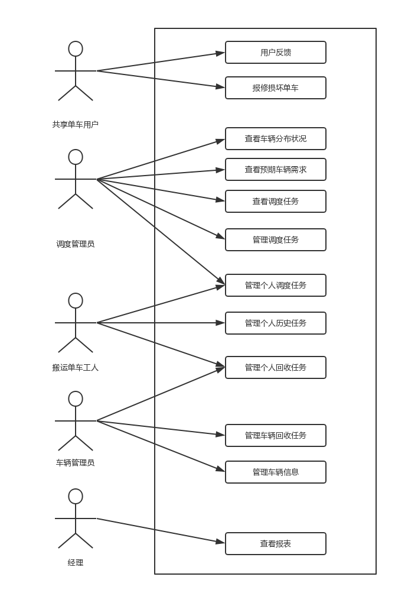

# 用例文档

[TOC]

## 需求方提出的问题

- 用户在上下班高峰期，以及在人流量较大的地区，共享单车数量还是明显不足。但是在不远处的居民区，车辆严重堆积，甚至影响到了交通。
- 用户经常会遇到坏车阻碍出行，并且遇到坏车没有反馈渠道，也无法退费。

## 更新历史

| 日期       | 更新者 | 更新内容               | 版本号 |
| ---------- | ------ | ---------------------- | ------ |
| 2018.10.23 | 陈俊宇 | 小组讨论后的第一版定稿 | V 1.0  |

## 引言

### 目的

本文档描述了Naive共享单车调度管理系统的用例图及用例文档 

### 阅读说明

用例描述的约定为必须要包含用例 ID、名称、创建日期、最后一次更新日期、参与者、触发条件、前置条件、后置条件、优先级、正常流程、扩展流程特殊需求。其中流程要完整有序地描述该用例中使用者与系统的交互 

### 参考文献

- 《需求工程——软件建模与分析（第二版）》 

## 用例列表 

| 用例编号 | 用例名称         | 参与者                   |
| -------- | ---------------- | ------------------------ |
| 1        | 用户反馈         | 共享单车用户             |
| 2        | 报修损坏单车     | 共享单车用户             |
| 3        | 管理个人调度任务 | 单车搬运工人、调度管理员 |
| 4        | 管理个人回收任务 | 单车搬运工人、车辆管理员 |
| 5        | 管理个人历史任务 | 单车搬运工人、车辆管理员 |
| 6        | 管理车辆回收信息 | 车辆管理员               |
| 7        | 管理车辆信息     | 车辆管理员               |
| 8        | 查看车辆分布状况 | 调度管理员               |
| 9        | 查看预期车辆需求 | 调度管理员               |
| 10       | 查看调度任务     | 调度管理员               |
| 11       | 管理调度任务     | 调度管理员               |
| 12       | 查看报表         | 经理                     |

## 用例图

## 详细用例描述

### 用例1 用户反馈

|     条目     | 内容                                                         |
| :----------: | :----------------------------------------------------------- |
|      ID      | 1                                                            |
|    创建者    | 廖均达                                                       |
|     时间     | 2018.10.21                                                   |
|     名称     | 用户反馈                                                     |
|  最后更新者  | 廖均达                                                       |
| 最后更新日期 | 2018.10.21                                                   |
|    参与者    | 共享单车用户                                                 |
|   触发条件   | 用户希望对单车使用感受进行反馈                               |
|   前置条件   | 用户已经经过验证                                             |
|   后置条件   | 记录用户反馈，更新反馈统计数据                               |
|    优先级    | 中                                                           |
|   正常流程   | 1. 用户选择进行意见反馈 2. 系统显示满意度选项，由低至高分为5个等级，并同时允许用户输入文字反馈信息 3. 用户输入满意度选项，并填写文字反馈信息 4. 系统记录并显示用户评价结果 |
|   扩展流程   | 3-2a. 用户没有输入满意度选项 &emsp;1. 系统提示满意度选项不能为空，要求用户重新输入 4-2a. 活动期间，系统显示用户评价结果，给予用户奖励并提示用户获得的奖励信息 |
|   特殊需求   | 无                                                           |

### 用例2 报修损坏单车

| 条目         | 内容                                                         |
| ------------ | ------------------------------------------------------------ |
| ID           | 2                                                            |
| 创建者       | 高梦婷                                                       |
| 创建时间     | 2018.10.17                                                   |
| 名称         | 报修损坏单车                                                 |
| 最后更新者   | 高梦婷                                                       |
| 最后更新日期 | 2018.10.17                                                   |
| 参与者       | 共享单车用户，目标是及时有效的对已损坏的单车进行报修         |
| 触发条件     | 共享单车用户希望报修已损坏的单车                             |
| 前置条件     | 用户已联网且进行了身份验证                                   |
| 后置条件     | 无                                                           |
| 优先级       | 中                                                           |
| 正常流程     | 1.用户选择报修损坏车辆 2.系统打开相机并提供二维码识别框 3.用户使用二维码识别框扫描共享单车上的二维码 4.系统识别单车信息并显示报修成功 |
| 拓展流程     | 1a.用户已经扫码打开了一辆单车 &emsp;1.系统提示是否报修当前车辆 &emsp;2.用户确认报修当前车辆 &emsp;3.系统识别单车信息并显示报修成功 3a.用户扫描的二维码不合法 &emsp;1.系统提示二维码错误并要求重新扫描 |
| 特殊需求     | 简单操作容易上手                                             |

### 用例3 管理个人调度任务

| 条目         | 内容                                                         |
| ------------ | ------------------------------------------------------------ |
| ID           | 3                                                            |
| 创建者       | 廖均达                                                       |
| 时间         | 2018.10.21                                                   |
| 名称         | 管理个人调度任务                                             |
| 最后更新者   | 廖均达                                                       |
| 最后更新日期 | 2018.10.21                                                   |
| 参与者       | 搬运单车工人、调度管理员                                     |
| 触发条件     | 用户希望查看当前调度任务                                     |
| 前置条件     | 用户身份已经被验证                                           |
| 后置条件     | 无                                                           |
| 优先级       | 高                                                           |
| 正常流程     | 1. 用户选择查看当前调度任务，系统显示用户当前的任务 2. 用户选择某一具体调度任务进行查看 3. 系统显示当前任务的详细信息，包括任务发布时间，任务时间要求，任务紧急程度，待搬运单车位置信息、数量信息，搬运目的地位置信息以及建议的路线 4. 用户完成任务后，选择结束完成的任务 5. 系统提示用户操作结果，记录任务完成信息并更新当前任务列表 |
| 扩展流程     | 4-4a. 用户在任务截止时间前10分钟没有确认完成任务 &emsp;1. 系统发送通知，提醒用户确认完成任务 4-4b. 用户超出任务截止时间10分钟内没有确认完成任务 &emsp;1. 系统判定此任务失败，记录后通知用户任务失败 4-4c. 由于不可预计的情况，用户无法接受或完成任务 &emsp;1. 用户请求延长任务时限，系统将请求发送给调度管理员 &emsp;2. 管理员输入是否接受请求，系统将请求结果显示给用户，更新任务信息并显示 &emsp;3. 用户请求放弃某任务，系统将请求发送给调度管理员 &emsp;4. 管理员输入是否接受请求，系统将请求结果显示给用户，更新任务信息并显示 |
| 特殊需求     | 1. 系统的通知信息要明显，能够容易被用户看见 2. 确认任务完成需要采取措施防止用户误操作 |

### 用例4 管理个人回收任务

| 条目         | 内容                                                         |
| ------------ | ------------------------------------------------------------ |
| ID           | 4                                                            |
| 创建者       | 廖均达                                                       |
| 时间         | 2018.10.21                                                   |
| 名称         | 管理个人回收任务                                             |
| 最后更新者   | 廖均达                                                       |
| 最后更新日期 | 2018.10.21                                                   |
| 参与者       | 搬运单车工人、车辆管理员                                     |
| 触发条件     | 用户希望查看当前回收任务                                     |
| 前置条件     | 用户已经经过验证                                             |
| 后置条件     | 无                                                           |
| 优先级       | 高                                                           |
| 正常流程     | 1. 用户选择查看当前回收任务，系统显示用户当前的任务 2. 用户选择某一具体回收任务进行查看 3. 系统显示当前任务的详细信息，包括任务发布时间，任务时间要求，任务紧急程度，待回收单车位置信息、数量信息，目标维修工厂位置信息以及建议的路线 4. 用户完成任务后，和维修站的车辆管理员确认完成 5. 车辆管理员确认后向系统确认任务完成 6. 系统显示操作结果，记录任务完成信息，更新任务列表并显示 |
| 扩展流程     | 5-4b. 用户超出任务截止时间10分钟，任务没有被确认完成 &emsp;1. 系统判定此任务失败，记录后通知用户任务失败 5-4c. 由于不可预计的情况，用户无法接受或完成任务 &emsp;1. 用户请求延长任务时限，系统将请求发送给车辆管理员 &emsp;2. 车辆管理员输入是否接受请求，系统将请求结果显示给用户，更新任务信息并显示 &emsp;3. 用户请求放弃该任务，系统将请求发送给车辆管理员 &emsp;4. 车辆管理员输入是否接受请求，系统将请求结果显示给用户，更新任务信息并显示 |
| 特殊需求     | 1. 系统通知信息要明显，容易被用户发现 2. 确认任务完成需要采取措施防止用户误操作 |

### 用例5 管理个人历史任务

| 条目         | 内容                                                         |
| ------------ | ------------------------------------------------------------ |
| ID           | 5                                                            |
| 创建者       | 廖均达                                                       |
| 时间         | 2018.10.21                                                   |
| 名称         | 管理个人历史任务                                             |
| 最后更新者   | 廖均达                                                       |
| 最后更新日期 | 2018.10.21                                                   |
| 参与者       | 搬运单车工人、车辆管理人员                                   |
| 触发条件     | 用户希望查看历史任务                                         |
| 前置条件     | 用户已经经过验证                                             |
| 后置条件     | 无                                                           |
| 优先级       | 高                                                           |
| 正常流程     | 1. 用户选择查看历史任务 2. 系统显示历史任务列表，列表的每一项显示该任务属于回收任务还是调度任务 3. 用户选择某个历史调度任务进行查看 &emsp;1. 系统显示该调度任务的详细信息，包括任务发布时间，任务是否完成，任务完成时间，任务紧急程度，待搬运单车位置信息、数量信息以及调度目的地信息 4. 用户选择某个历史回收任务进行查看 &emsp;1. 系统显示该回收任务详细信息，包括任务发布时间，任务是否完成，任务完成时间，任务紧急程度，待待回后单车位置信息、数量信息以及回收的目的维修工厂信息 5. 用户对所有的历史任务进行筛选和排序 &emsp;1. 系统显示筛选条件，包括任务类型、任务状态（包括完成、失败、转让）、任务完成时间、任务发布时间、任务紧急程度；系统显示排序条件，包括任务完成时间，任务发布时间，任务紧急程度 &emsp;2. 用户选择某个筛选条件以及某个排序维度，系统显示筛选和排序后的任务信息 |
| 扩展流程     | 1-2a. 用户选择查看历史任务统计信息 &emsp;1. 系统显示历史任务统计信息，包括任务完成状态情况统计、任务完成时间情况统计、任务完成数量情况统计 3-2a. 用户对某个失败的任务提出申诉，填写申诉理由后提交 &emsp;1. 系统将用户申诉显示给该负责该任务的管理员 &emsp;2. 管理员输入申诉判定结果（包括是否接受以及判定理由） &emsp;3. 系统将判定结果显示给申诉用户，更新并显示该历史任务状态 |
| 特殊需求     | 系统通知信息要明显，容易被用户发现                           |

### 用例6  管理车辆回收任务

|     条目     | 内容                                                         |
| :----------: | :----------------------------------------------------------- |
|      ID      | 5                                                            |
|    创建者    | 陈俊宇                                                       |
|     时间     | 2018.10.17                                                   |
|     名称     | 管理车辆回收任务                                             |
|  最后更新者  | 陈俊宇                                                       |
| 最后更新日期 | 2018.10.22                                                   |
|    参与者    | 车辆管理人员                                                 |
|   触发条件   | 车源管理人员希望管理车辆回收任务                             |
|   前置条件   | 车辆回收任务数据已存储在系统中，车辆管理人员已进行了身份验证 |
|   后置条件   | 系统存储更新后的任务信息                                     |
|    优先级    | 高                                                           |
|    正常流    | 1. 车辆管理人员向系统发出管理回收任务的请求 2. 系统向车辆管理人员提供一个回收任务的列表 3. 车辆管理人员选择自己想要查看的回收任务 4. 系统显示该任务的具体信息 5      5.1 车辆管理人员查看该任务的具体内容      5.2 车辆管理人员想对当前任务进行结算操作             5.2.1 车辆管理人员发出结算请求             5.2.2  系统更新任务状态并提示结算完成 6. 车辆管理人员退出任务管理 |
|   扩展流程   | 2a. 尚无回收任务       1. 系统提示暂无任务       2. 车辆管理人员退出查询 4a. 车辆管理人员想继续查看其他回收任务       1. 返回正常流程第2步 |

### 用例7 管理车辆信息

|     条目     | 内容                                                         |
| :----------: | :----------------------------------------------------------- |
|      ID      | 7                                                            |
|    创建者    | 陈俊宇                                                       |
|     时间     | 2018.10.17                                                   |
|     名称     | 管理车辆信息                                                 |
|  最后更新者  | 陈俊宇                                                       |
| 最后更新日期 | 2018.10.22                                                   |
|    参与者    | 车辆管理人员                                                 |
|   触发条件   | 车辆管理人员希望管理车辆信息                                 |
|   前置条件   | 车辆管理人员已进行了身份验证                                 |
|   后置条件   | 系统存储更新后的车辆信息                                     |
|    优先级    | 中                                                           |
|   正常流程   | 1.1 查看车辆信息       1.车辆管理人员发出查看车辆信息请求       2. 车辆管理人员选择筛选条件       3. 系统返回一个满足筛选条件的车辆信息的列表  1.2 增加车辆        1. 车辆管理人员请求添加车辆        2. 车辆管理人员登记车辆信息并提交        3. 系统提示添加成功 1.3 更新车辆修复信息        1. 车辆管理人员请求更新车辆修复信息车辆        2. 车辆管理人员选择要更新的车辆        3. 系统提示更新成功 1.4 删除车辆        1.  车辆管理人员请求删除车辆         2. 车辆管理人员选择要删除的车辆         3. 系统提示删除成功 |
|   扩展流程   | 1.2      3a. 车辆管理人员输入信息格式有误            1.系统提示输入信息格式有误，不保存 |

### 用例8 查看车辆分布状况

|      条目      | 内容                                                         |
| :------------: | :----------------------------------------------------------- |
|       ID       | 8                                                            |
|      名称      | 查看车辆分布状况                                             |
|     创建者     | 訾源                                                         |
| 最后一次更新者 | 訾源                                                         |
|    创建日期    | 2018年10月18日                                               |
|  最后更新日期  | 2018年10月18日                                               |
|     参与者     | 调度管理员                                                   |
|    触发条件    | 调度管理人员需要查看各个地区车辆分布                         |
|    前置条件    | 调度管理员已登录                                             |
|    后置条件    | 无                                                           |
|     优先级     | 高                                                           |
|    正常流程    | 1. 系统根据当前定位信息显示当前城市的车辆分布状况 2. 用户选择所需要查看的城市（区）  3. 系统根据用户选择的城市显示该城市的车辆分布状况 |
|    扩展流程    | 1a & 3a. 用户请求放大/缩小当前城市分布状况   1. 系统以放大/缩小的形式显示当前城市的地图以及车辆分布状况   1b & 3b. 用户请求拖拽地图  1. 系统显示拖拽后的地图所表示区域的车辆分布状况  |
|    特殊需求    | 无                                                           |

### 用例9 查看预期车辆需求

|      条目      | 内容                                                         |
| :------------: | :----------------------------------------------------------- |
|       ID       | 9                                                            |
|      名称      | 查看预期车辆需求                                             |
|     创建者     | 訾源                                                         |
| 最后一次更新者 | 訾源                                                         |
|    创建日期    | 2018年10月18日                                               |
|  最后更新日期  | 2018年10月18日                                               |
|     参与者     | 调度管理员                                                   |
|    触发条件    | 调度管理人员需要查看某地区某时间段的预期车辆需求             |
|    前置条件    | 调度管理员已登录                                             |
|    后置条件    | 无                                                           |
|     优先级     | 中                                                           |
|    正常流程    | 1. 系统根据当前定位信息显示当前城市的当前的预期车辆需求状况 2. 用户选择所需要查看的城市（区）  3. 用户选择所需要查看的时间段 4. 系统根据用户选择的城市显示该城市的预期车辆需求状况 |
|    扩展流程    | 1a & 4a. 用户请求放大/缩小当前城市预期车辆需求状况   1. 系统以放大/缩小的形式显示当前城市的地图以及预期车辆需求状况   1b & 4b. 用户请求拖拽地图  1. 系统显示拖拽后的地图所表示区域的预期车辆需求状况  2a. 所选择的城市未支持预期车辆需求  1. 系统提示“所选城市尚未支持车辆需求预测功能”，转入正常流程1 3a. 所选择城市目标时间段尚未预测出 1.系统提示“所选时间段的车辆需求暂未生成”，转入正常流程1 |
|    特殊需求    | 要求系统可以支持查看15天内的预期车辆需求状况                 |

### 用例10 查看调度任务

|      条目      | 内容                                                         |
| :------------: | :----------------------------------------------------------- |
|       ID       | 10                                                           |
|      名称      | 查看调度任务                                                 |
|     创建者     | 訾源                                                         |
| 最后一次更新者 | 訾源                                                         |
|    创建日期    | 2018年10月18日                                               |
|  最后更新日期  | 2018年10月18日                                               |
|     参与者     | 调度管理员                                                   |
|    触发条件    | 调度管理人员查看车辆调度任务时                               |
|    前置条件    | 调度管理员已登录                                             |
|    后置条件    | 无                                                           |
|     优先级     | 高                                                           |
|    正常流程    | 1. 系统根据当前定位信息显示当前城市的所有正在进行、未完成、未发布的车辆调度任务  2. 用户请求查看某个调度任务的详细状况   3. 系统显示调度任务的详细状况，包括当前状态、当前完成情况、任务具体内容、时间限制等信息 |
|    扩展流程    | 1a. 用户请求查看其他城市车辆调度任务  1. 系统显示用户所选择的城市的所有正在进行、未完成、未发布的车辆调度任务  1b. 用户请求查看已完成的任务  1. 系统显示当前显示的城市的所有已完成的车辆调度任务信息，按照时间进行排序，越接近当前时间，排序越靠前 |
|    特殊需求    | 无                                                           |

### 用例11 管理调度任务

|      条目      | 内容                                                         |
| :------------: | :----------------------------------------------------------- |
|       ID       | 11                                                           |
|      名称      | 管理调度任务                                                 |
|     创建者     | 訾源                                                         |
| 最后一次更新者 | 訾源                                                         |
|    创建日期    | 2018年10月18日                                               |
|  最后更新日期  | 2018年10月18日                                               |
|     参与者     | 调度管理员                                                   |
|    触发条件    | 调度管理人员管理车辆调度任务时                               |
|    前置条件    | 调度管理员已登录                                             |
|    后置条件    | 系统保存用户对车辆调度任务所做的更改，并记录日志             |
|     优先级     | 高                                                           |
|    正常流程    | 增加： 1. 用户选择添加调度任务功能   2. 系统显示已有信息（当前城市），并给出需要填写的信息，包括目标时间段，调度具体内容。 3. 用户填写有关调度任务和目标时间段，并提交。  4. 系统显示任务信息，并要求用户确认。  5. 用户确认。  6. 系统提交信息，并显示成功消息，并记录日志。  修改： 1. 用户选中任务并选择修改调功能   2. 系统显示当前任务的全部信息。 3. 用户修改他想要修改的信息，并提交。  4. 系统显示新的任务信息，并要求用户确认。  5. 用户确认。  6. 系统提交信息，并显示成功消息，并记录日志。删除：1. 用户选中任务并选择删除调功能   2. 系统显示当前任务的全部信息。  3. 系统要求用户确认。  5. 用户确认。  6. 系统提交信息，并显示成功消息，并记录日志。 |
|    扩展流程    | 无                                                           |
|    特殊需求    | 无                                                           |

### 用例12 查看报表

| 条目         | 内容                                                         |
| ------------ | ------------------------------------------------------------ |
| ID           | 12                                                           |
| 创建者       | 高梦婷                                                       |
| 创建时间     | 2018.10.17                                                   |
| 名称         | 查看报表                                                     |
| 最后更新者   | 高梦婷                                                       |
| 最后更新日期 | 2018.10.17                                                   |
| 参与者       | 经理，目标是查看各个报表以把控各方面数据                     |
| 触发条件     | 经理希望查看各个报表                                         |
| 前置条件     | 经理已联网且进行了身份验证                                   |
| 后置条件     | 无                                                           |
| 优先级       | 高                                                           |
| 正常流程     | 1.经理选择查看用车数据报表 2.系统显示用车数据报表 3.经理选择查看用户报损数据报表 4.系统显示用户报损数据报表 5.经理选择查看财务数据报表 6.系统显示财务数据报表 7.经理选择查看各类任务信息报表 8.系统显示各类任务信息报表 9.经理选择查看车辆分布数据报表 10.系统显示车辆分布数据报表 |
| 拓展流程     | 无                                                           |
| 特殊需求     | 简单操作容易上手                                             |

