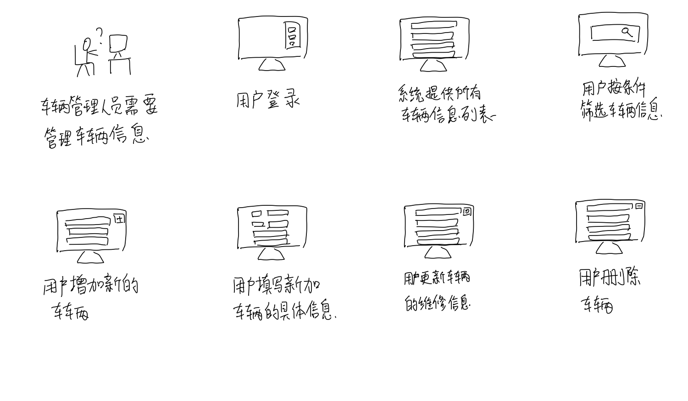
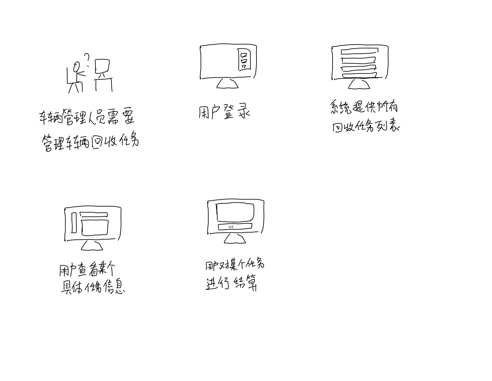

# 共享单车系统面谈报告

[TOC]

## 更新历史

| 日期         | 作者     | 更新内容 | 版本号  |
| ---------- | ------ | ---- | ---- |
| 2018.10.21 | 廖均达、訾源 | 初始化  | 1.0  |

## 前言

### 引言

一般而言，面对面的访谈是内容最丰富的交流方式，也是实践中获取需求最重要的方法。

### 目的

本文档旨在通过面对面的会见，就共享单车系统的开发获取到各项必要的信息，从而可以更加真实的把握用户需求，细化解决方案中存在的不明确的地方，在各个方面和用户之间达成共识，确定项目的解决方案。

### 阅读说明

本文档主要是需求工程活动中的整个面谈过程为主要内容。通过叙述面谈过程中的面谈计划，面谈过程，面谈报告以及参考内容。其中内容主要以录音和电子文档等方式进行面谈过程的记录工作。

### 参考文献

[1]需求工程:软件建模与分析，骆斌、丁二玉，高等教育出版社，2009-04-01， ISBN:9787040262957

## 面谈计划阶段

### 产生背景

Naive共享单车是软件学院某学长创办的共享单车企业。经营一段时间后，已经初具规模，但是随着公司体量的快速增长，总经理发现当初聘请`NJULighting`开发的单车系统已经不能解决现在面临的实际问题。

在人流量较大的地方，共享单车一车难求：尤其是晚上下班高峰期，单车往往被先到的人骑走了，而后来的人只能徒步回家。但是在附近的小区门口，共享单车堆积成山，严重影响了交通，现有系统并不能解决这个严重的问题。

同时，单车损坏现象也是十分严重。一方面是车辆缺乏定期保养，另一方面是用户没有一个反馈车辆损坏的渠道，扫到坏车后费用也无法退回，也正因为如此，用户对公司十分不满。

此外，随着公司刚刚完成了一轮融资，经理希望能够提高市场份额，进一步增加企业收入。

因此，经理希望能够在原有系统的基础上，进一步迭代开发单车调度管理系统，建立维修机制，从而提升用户体验，解决用车难、车辆损坏严重的问题，增加市场份额和公司收入。

### 第一次面谈

#### 面谈目的

- 对项目的前景和范围进行进一步的确认
- 明确业务需求
- 对目标分析产生的业务目标进行确认
- 明确具体业务细节
- 明确用例
- 明确用户操作偏好
- 分析过程中累积的问题，解决前期需求开发过程中的疑惑以及问题

#### 面谈对象

客户：董仕达

#### 面谈类型和面谈结构

本次面谈主要采取两种类型，开放式问题和封闭式问题。

#### 面谈问题

- 贵公司目前有多少辆共享单车
- 贵公司有多少的预算投入到这个项目中
- 目标公司当前的现有系统有哪些功能
  - 现有系统都记录了车辆的哪些信息
- 目标系统是否应该提供用户反馈功能
- 在之前的面谈中我们已经了解到目标公司需要一个调度管理平台
  - 你们是否希望我们能够预测各时段各地区车辆的需求状况？
  - 你们是否需要自动化生成调度任务？
    - 如果是，是否能够人为干预
    - 如果不是，你们希望以何种方式安排调度任务
  - 你们是否需要能够查看当前车辆分布状况？
  - 对于调度任务，你们希望以何种方式来安排人员进行执行？
- 在之前的面谈中我们了解到贵公司需要一个车辆维修管理平台
  - 你们是否需要自动化根据车辆历史使用情况和用户报修评估车辆状况
    - 如果不是，你们希望以何种方式鉴别出损坏车辆
    - 如果是，你们是否希望自动生成损坏车辆回收任务
      - 如果是，是否能够人为干预
      - 如果不是，你们希望以何种方式安排调度任务
  - 车辆维修是否自建维修厂或是和第三方维修车辆厂商进行合作
    - 如果自建维修厂，公司是否提供车辆管理人员
- 之前的面谈中我们了解到贵公司需要允许用户进行报修
  - 用户遇到损坏车辆时是否仍然正常进行收费
  - 用户进行报修是否有奖励
  - 用户是否需要证明车辆已经损坏
    - 如果是，你们希望用户以何种方式证明
- 在原有系统生成报表时是否要考虑新加入的功能生成的数据
- 你们是否考虑在某些地方先做试点
- 你们是否考虑法律法规和政府支持的问题
- 系统维护和管理人员方面
  - 系统开发完成后，是否继续交给我们维护

### 第二次面谈

#### 面谈目的

- 明确具体业务细节

#### 面谈问题

1. 搬车工人是否需要分为回收部门和调度部门
2. 请描述一下搬车工人执行调度的具体业务流程
3. 请描述一下搬车工人执行回收任务以及和车辆管理人员对接的具体业务流程
4. 待回收的单车是否仍然允许用户使用
5. 在不可预计的突发情况，或者工人实在无法在规定时间内完成任务的情况下，贵公司希望采取怎样的措施
6. 请分别描述一下系统生成的回收任务和调度任务的具体信息
7. 在上次的面谈中我们了解到贵公司不希望系统生成的回收任务受到人为的控制，但是系统总是存在不稳定性，贵公司是否接受一定程度上的人为控制
   1. 如果是，是否会引入专员负责此事
8. 在上次的面谈中我们了解到贵公司希望系统生成的调度任务支持人工调整，贵公司是否会引入专员负责此事
9. 请描述一下调度管理人员的业务流程

### 第三次面谈

#### 面谈目的

- 进行原型评估
- 进一步明确具体业务细节

#### 面谈问题

1. 和被面谈人员确认原型
2. 请描述一下调度管理人员和车辆管理人员对系统生成的任务具体能够执行哪些操作
3. 请描述一下管理人员能够查看系统生成的任务的哪些信息
4. 在上次面谈中我们了解到搬车工人没有在规定的时间限制内完成任务，任务就会失败，由于存在特殊情况，是否允许工人对失败的用户采取某种措施
5. 我们希望引入用户反馈这一功能，以获取用户的使用体验，贵公司对这个功能有什么要求或期望

## 面谈具体过程

### 第一次面谈

#### 面谈参与人员

项目组参与人员：

- 廖均达，项目经理
- 訾源，项目成员

客户方参与人员：

- 董仕达，总经理

#### 面谈时间

2018年10月21日

#### 面谈地点

南京大学鼓楼校区软件学院院楼7层

#### 面谈项目

Naive共享单车

#### 面谈方式

通过面对面的会见方式，同时有专业人士进行速记，还对面谈进行了全程录音。

#### 面谈内容

问：公司现在经营的规模如何？在南京投放的单车数量大概是多少？能够支持此次系统开发的预算有多少

答：公司目前在全国50个城市投放了超过120万辆共享单车，在南京的单车数量大概有3万辆；预算有500万人民币

问：公司的现有系统有哪些功能，是否有记录车辆的一些信息

答：目前的系统主要的功能有扫码骑车、车辆定位，车辆的型号、投放时间、数量等我们都有记录

问：公司现有系统是否提供了用户反馈的渠道

答：现有系统只能支持用户电话联系客服进行反馈

问：在之前的面谈中我们已经了解到贵公司需要一个调度管理平台，贵公司是否希望新的系统能够自动化生成调度任务，然后安排给工人去执行？

答：是的，我们希望这个系统能够结合历史和现在的车辆分布状况生成一个合理的调度方案

问：那么系统安排的调度任务是否支持人为的调整

答：需要支持人为干预

问：在之前的面谈中我们了解到贵公司需要一个车辆维修管理平台，那么贵公司是否需要对每一辆单车的状况进行实时评估？

答：是的，我们还希望能够提供用户报修渠道

问：对于损坏车辆的回收，贵公司有什么想法吗

答：我们希望能够回收任务也能够像之前提到的调度任务一样能够由系统自动生成并派发，并且损坏的车辆能够在24小时内得到回收

问：那系统安排的回收任务需要支持人为干预吗

答：不需要

问：贵公司的车辆维修是在自建的维修厂中进行还是和第三方维修厂商进行合作

答：自建维修厂

问：用户报修单车后是否还进行收费

答：扫到坏车，如果两分钟之内就结束使用，可以给用户免费；如果用户仍然能够继续使用，则正常收费

问：用户报修单车后是否给予奖励

答：可以适当给予奖励，比如下次骑车前 10 分钟免费

问：用户报修单车是否需要上传证明，如拍照取证

答：不需要，软件损坏以及某些硬件损坏不容易通过照片观察出来，直接报修即可

问：在现有系统生成的报表中是否要考虑新加入功能生成的数据

答：需要，我们希望能够将调度成本、回收成本等因素加入报表中

问：新系统开发出来后，是否希望先进行小范围的试点

答：需要进行小范围测试，先在南京部分地区进行测试

问：你们是否考虑法律法规和政府支持的问题

答：政府不反对，但是对车辆数量的投放有一定限制。在自行车停放区投放单车不违反法律法规

问：你们对系统的维护有什么要求

答：前期系统可能bug比较多，需要由开发方继续维护一段时间，后期系统稳定了，则交给公司内部人员进行维护

### 第二次面谈

#### 面谈参与人员

项目组参与人员：

- 廖均达，项目经理
- 訾源，项目成员
- 陈俊宇，项目成员
- 高梦婷，项目成员

客户方参与人员：

- 董仕达，总经理

#### 面谈时间

2018年10月22日

#### 面谈地点

南哪咖啡馆

#### 面谈项目

Naive共享单车

#### 面谈方式

通过面对面的会见方式，同时有专业人士进行速记，还对面谈进行了全程录音。

#### 面谈内容

问：在上次的面谈中我们了解到贵公司会安排搬车工人对车辆进行调度和回收，你们需要系统对执行不同任务的工人进行区分吗？

答：不需要，统一对待，只需要发布的任务能够区分是调度任务还是回收任务即可

问：请描述一下搬车工人执行调度任务的具体业务流程

答：工人接到任务后，按照任务信息执行任务，执行完成后和系统确认完成

问：调度任务信息除了基础的时间信息、车辆位置信息以及调度目的地位置信息外还需要显示哪些内容

答：任务的紧急程度，如果可以的话希望系统能够显示推荐的路线

问：请描述一下搬车工人执行回收任务的具体业务流程

答：工人接到任务，按照任务信息执行任务，回收车辆进入回收站后和车辆管理人员进行对接

问：回收任务的完成情况是否由车辆管理人员确定

答：是的

问：请描述一下车辆管理人员接收到回收的单车后的业务流程

答：管理人员对回收的单车向系统进行登记，单车维修完成后管理员向系统进行登记

问：回收任务信息除了基础的时间信息，车辆位置信息以及维修站位置信息外还需要显示哪些内容

答：需要回收的单车分布会比较分散，所以希望能够显示推荐的回收路线

问：待回收的单车是否仍然允许用户使用

答：不允许

问：没有在规定时间内完成任务是否需要采取什么措施

答：提供 10 分钟的缓冲时间，如果超出规定时间 10 分钟则将任务判定为失败

问：在不可预计的突发情况下，是否允许工人申请延长任务时限

答：允许，但是需要工人与管理人员进行确认

问：在工人无法完成后续任务的情况下，是否允许工人放弃后续的部分任务

答：可以，但是需要和管理人员进行确认

问：你们希望采用何种方式确认工人的确已经完成了任务

答：通过管理员监视车辆分布状况是否符合调度结果来判定

### 第三次面谈

#### 面谈参与人员

项目组参与人员：

- 廖均达，项目经理
- 訾源，项目成员
- 陈俊宇，项目成员
- 高梦婷，项目成员

客户方参与人员：

- 董仕达，总经理

#### 面谈时间

2018年10月23日

#### 面谈地点

南哪咖啡馆

#### 面谈项目

Naive共享单车

#### 面谈方式

通过面对面的会见方式，同时有专业人士进行速记，还对面谈进行了全程录音。

#### 面谈内容

问：调度管理人员和车辆管理员需要掌握系统生成任务的哪些信息？

答：除了之前谈到的基本的任务信息外，还需要执行人信息，任务修改记录，完成情况与任务状态

问：贵公司希望管理员对系统派发的任务有哪些权限？

答：增删查改

问：在上次面谈中我们了解到搬车工人没有在规定的时间限制内完成任务，任务就会失败，由于存在特殊情况，是否允许工人对失败的用户采取某种措施？

答：如果确实存在特殊情况，允许工人对失败任务提起申诉，申诉交给对应的管理员进行处理

问：为了更好地了解用户使用体验，我们打算添加用户反馈这一功能，贵公司对这个功能有什么期望？

答：希望能有评星和文字评价

## 面谈报告概要

### 第一次面谈

会见者：陈俊宇、高梦婷、廖均达、訾源

被会见者：董仕达

面谈日期：2018-10-21

会见目标：

1. 对项目前景和范围进行确认
2. 明确业务需求
3. 明确具体业务细节

| 谈话要点           | 被会见者观点                                                 |
| ------------------ | ------------------------------------------------------------ |
| 调度模块的要求     | 自动化生成和派发调度任务，支持人为调整                       |
| 损坏车辆回收的要求 | 自动化生成和派发回收任务，不需要支持认为调整，需要做到损坏车辆24小时内能够回收 |
| 用户报修的流程     | 系统支持用户报修，用户报修后仍使用单车超过两分钟则正常收费，报修后可给予用户适当奖励 |
| 政策法规问题       | 政府有限制总的投放的共享单车数量，在规定的区域投放一定数量的单车不违反法规 |
| 报表需要考虑的内容 | 需要考虑调度成本、回收成本等新加入的功能生成的数据           |
| 系统维护问题       | 前期由开发方维护，后期由单车公司内部人员维护                 |
| 现有系统的功能     | 扫码骑车、联系客服投诉或报修、支持车辆定位等                 |
| 记录的车辆信息     | 车辆的位置信息，车辆的型号、投放时间、数量等                 |

### 第二次面谈

会见者：陈俊宇、高梦婷、廖均达、訾源

被会见者：董仕达

面谈日期：2018-10-22

会见目标：

1. 明确具体业务细节

| 谈话要点                             | 被会见者观点                                                 |
| ------------------------------------ | ------------------------------------------------------------ |
| 搬车工人执行调度任务业务流程         | 工人收到系统派发的任务后执行任务，执行完成后向确认完成任务，如果有特殊情况发生，工人可以通过系统向管理员申请任务延时，或是申请放弃后续部分任务 |
| 搬车工人执行回收任务业务流程         | 工人收到系统派发的任务后实行，将回收车辆运送到维修站后向车辆管理员确认，车辆管理员确认后向系统确认工人任务完成。如果有特殊情况发生，工人可以通过系统向管理员申请任务延时，或是申请放弃后续部分任务 |
| 调度任务的具体信息                   | 任务发布时间、截止时间、待调度的单车位置信息、调度目的地位置信息、任务紧急程度、推荐路线 |
| 回收任务的具体信息                   | 任务发布时间、截止时间、待回收的单车位置信息、维修站位置信息、任务紧急程度、推荐的规划路线 |
| 车辆管理员在车辆回收过程中的业务流程 | 和回收工人进行对接，确认回收后将回收车辆信息输入系统；车辆维修完成后将车辆信息输入系统 |

### 第三次面谈

会见者：陈俊宇、高梦婷、廖均达、訾源

被会见者：董仕达

面谈日期：2018-10-23

会见目标：

1. 进行原型评估
2. 明确具体业务细节

| 谈话要点                             | 被会见者观点                                                 |
| ------------------------------------ | ------------------------------------------------------------ |
| 系统能够支持的调度管理员对任务的操作 | 添加调度任务，修改任务信息和删除任务                         |
| 搬车工人对失败任务的处理             | 允许工人对失败任务发起申诉，申诉交给管理员处理，处理后通知工人处理结果 |
| 管理员能够查看的任务信息             | 执行工人、当前状态、当前完成情况、任务具体内容、时间限制     |
| 用户反馈的具体流程                   | 用户反馈内容包括等级评价和文字评价，等级评价是必须的，文字评价不必须 |

## 故事板原型

#### 用户反馈

#### 搬车工人管理个人当前任务

#### 搬车工人管理个人历史任务

#### 车辆管理员管理车辆信息

车辆管理员管理回收任务

