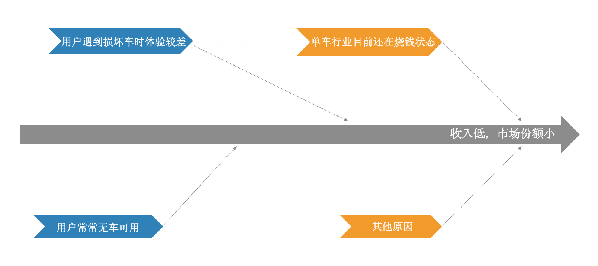
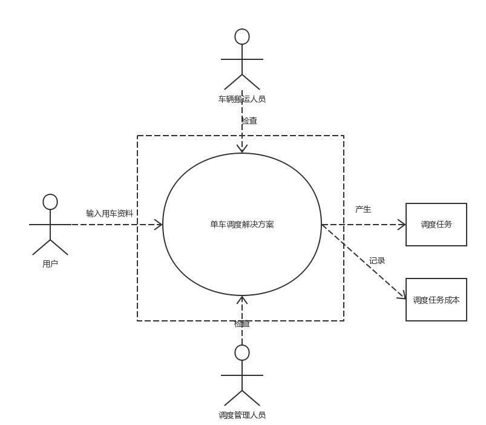
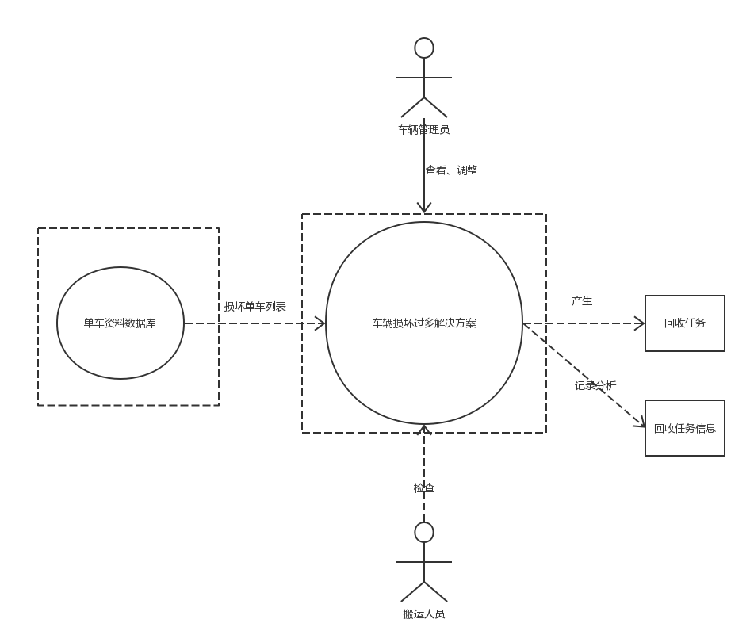
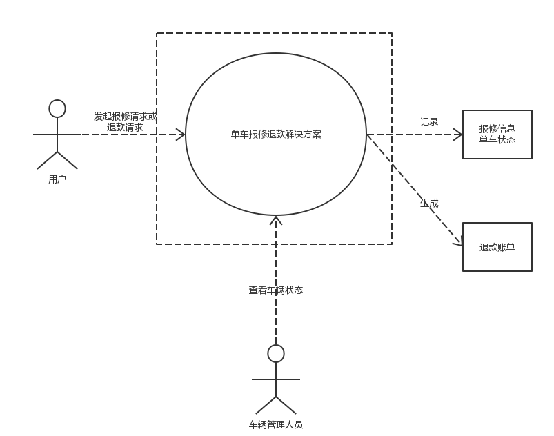
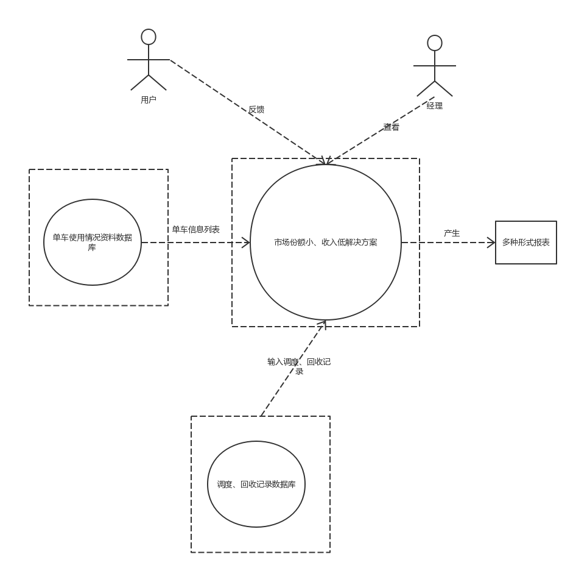
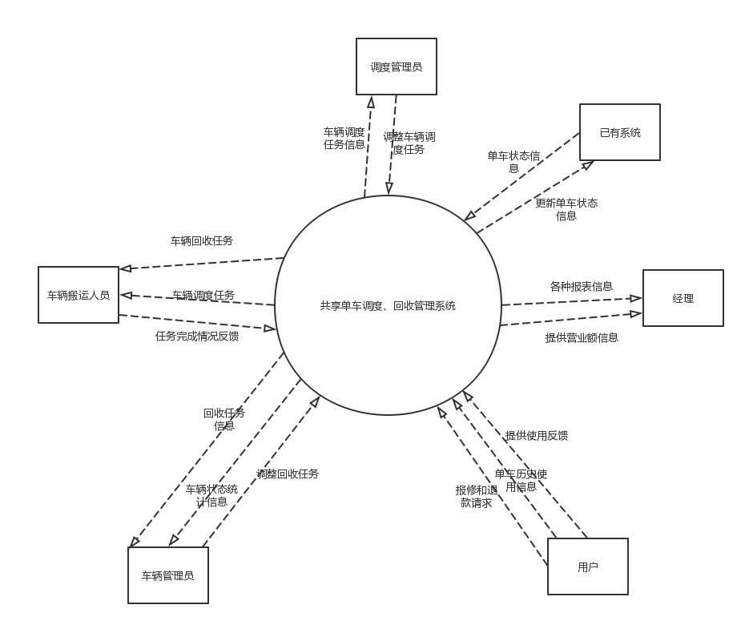

# 过程分析文档

[TOC]

## 明确问题

### 初步了解问题

Naive共享单车是软件学院某学长创办的共享单车企业。经营半年多，公司初具规模，但是目前增长出现了停滞的趋势。

虽然公司在各大城市投放了大量的单车，但是在网上还是被打上了单车少的标签，尤其是上下班高峰期，以及在人流量较大的地区，这种现象更是明显。但是在不远处的居民区，车辆严重堆积，甚至影响到了交通。

单车损坏现象也十分严重。历次对用户的问卷调查均表明单车损坏现象是阻碍用户使用公司单车的重要因素。更让用户恼火的是，遇到坏车没有反馈渠道，也无法退费。

由于公司刚刚进行了一轮融资，目前资金充沛。总经理也野心勃勃，想在解决现在的问题的同时提高市场份额，增加公司收入。

所以公司经理希望我们能在原有的系统的基础上进一步开发单车调度管理系统，建立维修机制，从而提升用户体验，解决用车难、车辆损坏严重的问题，增加市场份额和公司收入。

我们通过开会讨论，从中提取出了一些客户希望表达的问题和我们开发团队的疑问并记录下来，然后与客户进行了第一轮面谈，面谈报告如下：

### 面谈报告

#### 基本信息

**会见者**：陈俊宇，高梦婷，廖均达，訾源

**被会见者**：董仕达

**日期**：2018年10月8日

**会见目标&谈话要点**：

- 简要说明下公司当前的业务
- 了解公司当前阶段的问题
- 了解客户的希望和目标

**被会见者观点**

- 找车困难
- 车辆损坏率高
- 客户满意度不高
- 收入低
- 市场份额小

**下次会见的目标**

- 对本次面谈中不明确的地方进行进一步面谈和了解
- 对提出的解决方案进行评估
- 找出下一个被会见者的观点

通过此次面谈，我们了解到了该店的一些情况：

1. 目前状况

   - 存在遗留系统，开发组织为`NJULighting`，代码质量较差
   - 主要的职工有财务人员，经理。
   - 业务流程：向城市投放共享单车，用户扫码开锁使用。
   - 目前占有率、盈利、用户评价均不理想，可能是以下原因导致：
     - 高峰期难以找到共享单车
     - 损坏率高

2. 客户希望实现的功能：

   - 在原有系统上进一步开发单车调度管理系统
   - 建立车辆维修机制
   - 提供用户反馈问题车辆功能以及退款功能

3. 总的概述

   当前，在车辆维护、调度、问题反馈等方面存在问题，需要解决。

### 问题达成共识

| 要素   | 内容             |
| ---- | -------------- |
| ID   | P1             |
| 提出者  | 经理             |
| 关联者  | 单车用户           |
| 问题   | 用户找车困难，高峰期无车可用 |
| 影响   | 用户体验下降         |

| 要素   | 内容                |
| ---- | ----------------- |
| ID   | P2                |
| 提出者  | 经理                |
| 关联者  | 单车用户              |
| 问题   | 用户使用中碰到损坏车的可能性非常大 |
| 影响   | 用户体验下降            |

| 要素   | 内容                 |
| ---- | ------------------ |
| ID   | P3                 |
| 提出者  | 经理                 |
| 关联者  | 单车用户               |
| 问题   | 用户无法对损坏车辆进行报修，并且退款 |
| 影响   | 用户体验极差，人员大量流失      |

| 要素   | 内容                        |
| ---- | ------------------------- |
| ID   | P4                        |
| 提出者  | 经理                        |
| 关联者  | 无                         |
| 问题   | 尽管公司目前资金雄厚，但是市场份额很小，收入也很低 |
| 影响   | 无法长期占领市场，达到实现企业最终目标       |

**收集背景资料，判断问题的明确性**

我们通过收集有关该公司经营的背景资料，结合客户提出的问题，分析理解问题域，对上述五个问题的明确性做了初步的判断，认为只有第4个问题比较模糊，是不明确的，其他三个问题都是明确一致的。

**分析不明确的问题，发现问题背后的问题**

通过进一步收集相关的资料以及与涉众进行接触，我们发现导致市场份额和收入较小的原因可能有多个，我们制作了如下的鱼骨图说明原因：

## 涉众分析

### 涉众识别和描述

### 涉众评估

## 发现业务需求

确定每一个问题对应的目标的过程就是发现业务需求的过程。因此，针对上述4个高层次问题，我们确定了对应的业务需求。将问题描述表扩展成以下的问题及业务需求描述表：

| 要素   | 内容                                     |
| ---- | -------------------------------------- |
| ID   | P1                                     |
| 提出者  | 经理                                     |
| 关联者  | 单车用户                                   |
| 问题   | 用户找车困难，高峰期无车可用                         |
| 影响   | 用户体验下降                                 |
| 目标   | 系统应用之后的六个月内，缓解用车难问题，高峰期找到车的概率应该在70%以上。 |

| 要素   | 内容                                    |
| ---- | ------------------------------------- |
| ID   | P2                                    |
| 提出者  | 经理                                    |
| 关联者  | 单车用户                                  |
| 问题   | 用户使用中碰到损坏车的可能性非常大                     |
| 影响   | 用户体验下降                                |
| 目标   | 系统应用之后的六个月内，共享单车的可用率增加。好车比例应当达到85%以上。 |

| 要素   | 内容                 |
| ---- | ------------------ |
| ID   | P3                 |
| 提出者  | 经理                 |
| 关联者  | 单车用户               |
| 问题   | 用户无法对损坏车辆进行报修，并且退款 |
| 影响   | 用户体验极差，人员大量流失      |
| 目标   | 目标同P2。             |

| 要素   | 内容                                       |
| ---- | ---------------------------------------- |
| ID   | P4                                       |
| 提出者  | 经理                                       |
| 关联者  | 无                                        |
| 问题   | 尽管公司目前资金雄厚，但是市场份额很小，收入也很低                |
| 影响   | 无法长期占领市场，达到实现企业最终目标                      |
| 目标   | 1. 系统应用之后的六个月内，公司收入增加40%以上。2. 系统应用之后的六个月内，市场份额要达到15%以上。 |

此外，综合P1、P2、P3还可以得到企业目标：

系统应用之后的六个月内，公司的口碑明显提升，用户满意度增加，至少要达到90%以上。

## 定义解决方案及系统特性

### 确定高层次的解决方案

首先，我们对每一个明确一致的问题都尽可能发现各种可行的解决方案：

| 问题   | 解决方案                                     |
| ---- | ---------------------------------------- |
| P1   | S1：记录顾客历史用车信息，建立车辆使用资料数据库 S2：实现一个自动化调度子模块，自动安排调度工作人员对各个位置的单车进行调度 S3：向市场投放更多数量的单车 |
| P2   | S1：记录损坏车辆的信息，通过自动化调度子模块安排调度工作人员对损坏的车辆进行回收 |
| P3   | S1：系统提供用户报修车辆的功能 S2：系统提供为用户退费的通道      |
| P4   | S1：记录调度、回收单车进行维修的成本信息，每隔一段时间为管理层提供各种形式的报表 S2：系统提供用户反馈功能，并能生成各种报表 S3：记录顾客历史用车信息，建立车辆使用资料数据库并生成各种报表 |

然后，我们对每个问题分析不同方案的业务优势和代价，将它们一一用标准化的格式描述成表：

| 要素   | 内容                                       |
| ---- | ---------------------------------------- |
| ID   | P1                                       |
| 方案描述 | 记录顾客历史用车信息，建立车辆使用资料数据库；实现一个自动化调度子模块，自动安排调度工作人员对各个位置的单车进行调度 |
| 业务优势 | 记录历史用车信息从而更好的对车辆使用情况进行分析，实现自动化调度子模块能够使得调度效率更高，单车使用率更高 |
| 代价   | 实现功能模块的软件费用，投放更多单车所需要的费用以及新增的调度人员所需要的费用  |

| 要素   | 内容                                     |
| ---- | -------------------------------------- |
| ID   | P2                                     |
| 方案描述 | 记录损坏车辆的信息，及时安排调度工作人员对损坏的车辆进行回收         |
| 业务优势 | 记录并及时回收修复损坏车辆能够提高共享单车的可用率，是用户成功骑车的几率上升 |
| 代价   | 实现功能模块的软件费用，回收并修复损坏单车的费用               |

| 要素   | 内容                                       |
| ---- | ---------------------------------------- |
| ID   | P3                                       |
| 方案描述 | 系统提供用户报修车辆的功能，并提供用户退费通道                  |
| 业务优势 | 提供用户报修车辆功能能够帮助车辆回收人员更快定位并回收损坏车辆，提供退费服务能够缓解用户用不到车的难度 |
| 代价   | 实现功能模块的软件费用                              |

| 要素   | 内容                                       |
| ---- | ---------------------------------------- |
| ID   | P4                                       |
| 方案描述 | 系统提供用户反馈功能；记录顾客历史用车信息，建立车辆使用资料数据库；记录调度、回收单车进行维修的成本信息，每隔一段时间为管理层提供各种形式的报表 |
| 业务优势 | 集中处理反馈意见、车辆使用情况以及各种成本信息并生成报表能够更好地帮助管理层更加方便管理以及制定相关策略使得市场份额增加 |
| 代价   | 实现功能模块的软件费用                              |

### 确定系统特性和解决方案的边界

在选定解决方案之后，我们进一步明确了该解决方案需要具备的功能特征，即系统特征：

| 针对的问题 | 解决方案需要具备的系统特性                            |
| ----- | ---------------------------------------- |
| P1    | 1. 系统记录历史用车信息 2. 系统能够根据历史用车信息，分析并派发共享单车调度任务 |
| P2    | 1. 系统能够记录并且定位损坏的车辆 2. 系统能派发回收损坏车辆任务   |
| P3    | 1. 用户能够处理用户的报修请求 2. 用户能够处理用户的退费请求     |
| P4    | 1. 系统记录用户反馈数据、历史用车信息、运营成本信息，自动化生成各种报表    |

然后根据这些功能特征，分析解决方案需要和周围环境形成的交互作用，定义解决 方案的边界。解决方案的边界确定了信息流的输入输出关系：

P1解决方案

P2 解决方案

P3 解决方案

P4 解决方案

### 确定解决方案的约束

约束在总体上限制了开发人员设计和构建系统时的选择范围。我们从操作性、系统及操作系统、设备预算、人员资源和技术要求这几个主要的约束源来考察每个解决方案 的约束，如下表所示：

P1

| 约束源     | 约束                       | 理由                     |
| ------- | ------------------------ | ---------------------- |
| 操作性     | 需要对车辆搬运人员和调度管理员进行相关的培训   | 使系统分发的任务能够得到最高效的执行     |
| 系统及操作系统 | 需要结合已有系统的车辆定位等接口进行开发     | 采用已有系统的接口可以节省资源        |
| 设备预算    | 系统在以架构好的服务器和主机上开发        | 控制成本，方便                |
| 人员资源    | 需要聘请一定数量的车辆搬运人员          | 固定操作成本                 |
| 技术要求    | 良好的人机交互，良好的调度算法，使用机器学习技术 | 方便调度管理员管理任务，车辆搬运人员执行任务 |

P2

| 约束源     | 约束                          | 理由                     |
| ------- | --------------------------- | ---------------------- |
| 操作性     | 需要对车辆搬运人员和车辆管理员进行相关的培训      | 是系统分发的回收任务能够高效执行       |
| 系统及操作系统 | 需要结合已有系统的车辆定位、获取车辆状态等接口进行开发 | 采用已有系统的接口可以节省资源，加快开发速度 |
| 设备预算    | 系统在以架构好的服务器和主机上开发           | 控制成本，方便                |
| 人员资源    | 需要聘请一定数量的车辆搬运人员             | 固定操作成本                 |
| 技术要求    | 良好的人机交互，良好的回收调度算法           | 方便车辆管理员管理任务，车辆搬运人员执行任务 |

P3

| 约束源     | 约束                    | 理由              |
| ------- | --------------------- | --------------- |
| 操作性     | 需要通过一定手段使用户主动报修       | 系统需要记录用户反馈信息    |
| 系统及操作系统 | 需要使用已有系统的支付接口进行金钱相关操作 | 系统需要能够处理用户的退款请求 |
| 设备预算    | 系统在以架构好的服务器和主机上开发     | 控制成本，方便         |
| 人员资源    | 不需要外部人员，使用已有的员工       | 固定操作成本          |
| 技术要求    | 良好的人机交互               | 方便用户进行报修和退款     |

P4

| 约束源     | 约束                | 理由                    |
| ------- | ----------------- | --------------------- |
| 操作性     | 需要通过一定手段获得用户反馈    | 系统需要根据反馈进行工作          |
| 系统及操作系统 | 系统提供多种形式的报表和图表    | 方便管理人员对问题进行分析         |
| 设备预算    | 系统在以架构好的服务器和主机上开发 | 控制成本，方便               |
| 人员资源    | 不需要外部人员，使用已有的员工   | 固定操作成本                |
| 技术要求    | 使用面向对象技术          | 增加系统可扩展性，支持多种形式及自定义报表 |

### 确定系统边界

最后将所有问题的解决方案进行综合，就可以得到整个解系统的功能和边界。

为了更直观地描述系统的功能和边界，我们绘制了“Naive共享单车”系统的上下文图：

在这个上下文图中表示出了所有和共享单车系统交互的外部实体，并描述出了交互的数据流， 包括系统输入和系统输出。

